Yes. And for **Jeanius**, I would make the backlog specifically around the product specification you provided—not simply copy the Taskora structure.

There are a few important architectural decisions I would lock into the roadmap first:

* **Monorepo:** Turborepo + pnpm
* **Apps:** `apps/storefront` and `apps/admin`
* **Framework:** Next.js App Router + TypeScript
* **Database:** Supabase PostgreSQL
* **ORM:** Drizzle
* **Validation/contracts:** Zod
* **Storefront state:** **Zustand**
* **Auth:** Supabase Auth
* **Storage:** Supabase Storage initially, behind an abstraction
* **Backend:** Next.js Server Actions/API routes for application-facing operations, with Supabase Edge Functions only where they provide a real boundary; **no unnecessary standalone API service**
* **Payments:** provider-independent Payment Orchestrator
* **Core architecture:** DDD/modular monolith
* **Admin:** separate Next.js application focused on commerce, production, inventory, orders, content, customers and operations
* **OM/DROP:** first-class domain concepts, not product tags sprinkled throughout the UI

I would also rename `apps/users` → `apps/storefront` as your proposal suggests. It is clearer and leaves room for future account/member applications.

Below is the kind of **Production Implementation Master Roadmap** I would use.

---

# JEANIUS — PRODUCTION IMPLEMENTATION MASTER TODO

**Product:** Jeanius
**Target:** Production-ready global handmade denim commerce platform
**Architecture:** DDD modular monolith in a Turborepo monorepo
**Frontend:** Next.js App Router + TypeScript
**Database:** Supabase PostgreSQL + Drizzle ORM
**State:** Zustand
**Validation:** Zod
**Authentication:** Supabase Auth
**Payments:** Provider-independent Payment Orchestrator
**Initial storefront:** `apps/storefront`
**Operations/admin:** `apps/admin`

**Initial status:** `NOT_STARTED`

---

# STATE 00 — PRODUCT CONTRACT & ARCHITECTURE FOUNDATION

## Goal

Turn the product specification into an implementation contract before writing feature code.

| ID     | Task                                  | Description                                                                              | Status      |
| ------ | ------------------------------------- | ---------------------------------------------------------------------------------------- | ----------- |
| JN-001 | Freeze product scope                  | Establish MVP, Phase 2 and explicitly excluded functionality.                            | DONE        |
| JN-002 | Freeze commerce models                | Formalize OM, DROP and future product types.                                             | DONE        |
| JN-003 | Define actor model                    | Customer, member, admin, production staff, support and super-admin.                      | DONE        |
| JN-004 | Define order lifecycle                | Cart → Checkout → Payment → Order → Production/Fulfillment → Shipment → Delivery.        | DONE        |
| JN-005 | Define OM lifecycle                   | Configuration → Payment → Production Job → QC → Fulfillment → Shipment.                  | DONE        |
| JN-006 | Define DROP lifecycle                 | Inventory → Purchase → Fulfillment → Shipment → Delivery/Return.                         | DONE        |
| JN-007 | Define product lifecycle              | Draft → Scheduled → Published → Sold Out → Archived.                                     | DONE        |
| JN-008 | Define variant lifecycle              | Available → Sold Out → Disabled → Archived.                                              | DONE        |
| JN-009 | Define payment lifecycle              | Initiated → Pending → Paid/Failed/Expired → Refunded/Partially Refunded.                 | DONE        |
| JN-010 | Define production lifecycle           | Queued → Cutting → Sewing → Washing → Hardware → QC → Ready → Shipped.                   | DONE        |
| JN-011 | Define shipment lifecycle             | Pending → Packed → Shipped → In Transit → Delivered → Returned.                          | DONE        |
| JN-012 | Define return/refund lifecycle        | Requested → Approved/Rejected → Processing → Completed.                                  | DONE        |
| JN-013 | Define membership/access model        | Public, authenticated and protected/member-only states.                                  | DONE        |
| JN-014 | Define support model                  | Instagram/email/custom-order support boundaries.                                         | DONE        |
| JN-015 | Define terminology                    | Create canonical Jeanius domain glossary.                                                | DONE        |
| JN-016 | Create domain map                     | Map Product, Catalog, Cart, Order, Payment, Production, Shipping, etc.                   | DONE        |
| JN-017 | Define domain dependencies            | Establish allowed dependencies between domains.                                          | DONE        |
| JN-018 | Define architectural boundaries       | Prevent UI/database/provider leakage into domain logic.                                  | DONE        |
| JN-019 | Define server/client boundaries       | Decide what runs in Server Components, Client Components, Server Actions and API routes. | DONE        |
| JN-020 | Create ADR system                     | Establish Architecture Decision Records.                                                 | DONE        |
| JN-021 | Write architecture ADR                | Record modular-monolith decision.                                                        | DONE        |
| JN-022 | Write ORM ADR                         | Record Drizzle/Supabase decision.                                                        | DONE        |
| JN-023 | Write state ADR                       | Record Zustand decision.                                                                 | DONE        |
| JN-024 | Write API ADR                         | Define Next.js server boundary strategy.                                                 | DONE        |
| JN-025 | Write payment ADR                     | Define Payment Orchestrator architecture.                                                | DONE        |
| JN-026 | Define Definition of Done             | Production completion requirements.                                                      | DONE        |
| JN-027 | Define production readiness checklist | Launch requirements from the beginning.                                                  | DONE        |

**Exit:** Jeanius has a frozen product and architecture contract.

---

# STATE 01 — MONOREPO FOUNDATION

## Goal

Create the production repository structure.

```text
jeanius/
├── apps/
│   ├── storefront/
│   └── admin/
│
├── packages/
│   ├── domain/
│   ├── application/
│   ├── database/
│   ├── contracts/
│   ├── integrations/
│   ├── ui/
│   ├── config/
│   ├── observability/
│   └── testing/
│
├── infrastructure/
│   └── supabase/
│
├── docs/
│   ├── architecture/
│   ├── adr/
│   ├── product/
│   ├── api/
│   └── operations/
│
├── scripts/
├── .github/
├── turbo.json
├── pnpm-workspace.yaml
└── package.json
```

| ID     | Task                             | Description                                        | Status      |
| ------ | -------------------------------- | -------------------------------------------------- | ----------- |
| JN-028 | Initialize Git repository        | Create repository and initial branch strategy.     | DONE        |
| JN-029 | Initialize pnpm workspace        | Configure package manager.                         | DONE        |
| JN-030 | Initialize Turborepo             | Configure build/task orchestration.                | DONE        |
| JN-031 | Create `apps/storefront`         | Initialize customer-facing Next.js application.    | DONE        |
| JN-032 | Create `apps/admin`              | Initialize internal admin Next.js application.     | DONE        |
| JN-033 | Create `packages/domain`         | Framework-independent business domain.             | DONE        |
| JN-034 | Create `packages/application`    | Use cases/application services.                    | DONE        |
| JN-035 | Create `packages/database`       | Drizzle schema and repository implementations.     | DONE        |
| JN-036 | Create `packages/contracts`      | Zod/API/event contracts.                           | DONE        |
| JN-037 | Create `packages/integrations`   | Payment, shipping, email and external adapters.    | DONE        |
| JN-038 | Create `packages/ui`             | Shared design-system components.                   | DONE        |
| JN-039 | Create `packages/config`         | Shared typed configuration.                        | DONE        |
| JN-040 | Create `packages/observability`  | Logging/metrics primitives.                        | DONE        |
| JN-041 | Create `packages/testing`        | Shared test utilities.                             | DONE        |
| JN-042 | Create Supabase infrastructure   | Local Supabase configuration and migrations.       | DONE        |
| JN-043 | Create docs structure            | Architecture/product/API/operations documentation. | DONE        |
| JN-044 | Configure workspace dependencies | Establish allowed package relationships.           | DONE        |
| JN-045 | Verify workspace build           | Confirm every package/app compiles.                | DONE        |

**Exit:** Monorepo exists and every architectural layer has a defined home.

---

# STATE 02 — ENGINEERING GOVERNANCE

| ID     | Task                           | Description                                               | Status      |
| ------ | ------------------------------ | --------------------------------------------------------- | ----------- |
| JN-046 | Enable strict TypeScript       | Strict mode across repository.                            | DONE        |
| JN-047 | Configure ESLint               | Shared lint rules.                                        | DONE        |
| JN-048 | Configure Prettier             | Shared formatting.                                        | DONE        |
| JN-049 | Configure import rules         | Prevent invalid architectural imports.                    | DONE        |
| JN-050 | Define domain dependency rules | Domain cannot depend on infrastructure/UI.                | DONE        |
| JN-051 | Define database rules          | Database access only through repository/data layer.       | DONE        |
| JN-052 | Define client/server rules     | Prevent server secrets/code from entering client bundles. | DONE        |
| JN-053 | Define error rules             | Standardize domain/application/API errors.                | DONE        |
| JN-054 | Define validation rules        | Zod at external boundaries.                               | DONE        |
| JN-055 | Define naming conventions      | Files, entities, repositories, actions and components.    | DONE        |
| JN-056 | Define testing requirements    | Establish required test level by feature.                 | DONE        |
| JN-057 | Define migration rules         | Database changes must use migrations.                     | DONE        |
| JN-058 | Define security rules          | Authentication, authorization, secrets, uploads and PII.  | DONE        |
| JN-059 | Define observability rules     | Structured logging and critical event tracking.           | DONE        |
| JN-060 | Define commit rules            | Conventional commits/review requirements.                 | DONE        |
| JN-061 | Define CI quality gates        | Build, lint, typecheck, test and security checks.         | DONE        |
| JN-062 | Create contributor guide       | Explain repository architecture and workflows.            | DONE        |

**Exit:** Engineering governance codified in `.agents/rules/`, CI quality gates verified, and monorepo enforces zero-error builds.

---

# STATE 03 — DOMAIN MODEL

## Goal

Create the actual Jeanius business language in code.

### Core domains

```text
Identity
Catalog
Product Configuration
Cart
Checkout
Order
Payment
Production
Inventory
Shipping
Customer
Membership
Content
Reviews
Q&A
Support
Custom Orders
Notifications
```

| ID     | Task                             | Description                                    | Status      |
| ------ | -------------------------------- | ---------------------------------------------- | ----------- |
| JN-063 | Create domain ID types           | Strongly typed IDs.                            | NOT_STARTED |
| JN-064 | Create Money value object        | Currency + minor-unit representation.          | NOT_STARTED |
| JN-065 | Create Address value object      | Country/region/postal/address structure.       | NOT_STARTED |
| JN-066 | Create Product entity            | Core product aggregate.                        | NOT_STARTED |
| JN-067 | Create ProductOption entity      | Configurable option definition.                | NOT_STARTED |
| JN-068 | Create OptionValue entity        | Individual option values.                      | NOT_STARTED |
| JN-069 | Create Variant entity            | Concrete purchasable configuration.            | NOT_STARTED |
| JN-070 | Create ProductType               | OM/DROP/pre-order/future types.                | NOT_STARTED |
| JN-071 | Create Cart entity               | Customer/guest cart aggregate.                 | NOT_STARTED |
| JN-072 | Create CartLine entity           | Exact variant/configuration snapshot.          | NOT_STARTED |
| JN-073 | Create Order entity              | Immutable commercial transaction.              | NOT_STARTED |
| JN-074 | Create OrderLine entity          | Exact purchased configuration.                 | NOT_STARTED |
| JN-075 | Create Payment entity            | Internal payment state.                        | NOT_STARTED |
| JN-076 | Create ProductionJob entity      | Manufacturing work order.                      | NOT_STARTED |
| JN-077 | Create Shipment entity           | Fulfillment/shipping state.                    | NOT_STARTED |
| JN-078 | Create Review entity             | Product review.                                | NOT_STARTED |
| JN-079 | Create Question entity           | Product Q&A.                                   | NOT_STARTED |
| JN-080 | Create CustomOrderRequest entity | Controlled custom-order workflow.              | NOT_STARTED |
| JN-081 | Create Announcement entity       | Operational homepage notices.                  | NOT_STARTED |
| JN-082 | Create ContentPage entity        | CMS-like content.                              | NOT_STARTED |
| JN-083 | Create Membership entity         | Protected-content access.                      | NOT_STARTED |
| JN-084 | Define domain events             | Product, order, payment and production events. | NOT_STARTED |
| JN-085 | Create FabricBolt aggregate      | Narrow shuttle-loom continuous yardage allocation. | NOT_STARTED |
| JN-086 | Create InventoryReservation      | Two-phase hold (atomic claim + 10-minute TTL).   | NOT_STARTED |
| JN-087 | Create LedgerEntry entity        | Double-entry financial audit & accounting log.  | NOT_STARTED |
| JN-088 | Create ExportDeclaration VO      | Nepal customs export compliance & HS 6203.42.    | NOT_STARTED |
| JN-089 | Expand Shipment aggregate        | Multi-package split fulfillment (DROP vs. OM).   | NOT_STARTED |

---

# STATE 04 — DATABASE / SUPABASE FOUNDATION

## Goal

Create PostgreSQL schema around the domain and actual access patterns.

| ID     | Task                          | Description                              | Status      |
| ------ | ----------------------------- | ---------------------------------------- | ----------- |
| JN-085 | Configure Supabase project    | Development environment.                 | NOT_STARTED |
| JN-086 | Configure local Supabase      | Local database/auth/storage environment. | NOT_STARTED |
| JN-087 | Configure Drizzle             | Database connection/configuration.       | NOT_STARTED |
| JN-088 | Create migration system       | Version-controlled schema changes.       | NOT_STARTED |
| JN-089 | Create users/profile schema   | Customer/member profile data.            | NOT_STARTED |
| JN-090 | Create addresses schema       | Saved shipping addresses.                | NOT_STARTED |
| JN-091 | Create products schema        | Product records.                         | NOT_STARTED |
| JN-092 | Create product images schema  | Image metadata and ordering.             | NOT_STARTED |
| JN-093 | Create product options schema | Option definitions.                      | NOT_STARTED |
| JN-094 | Create option values schema   | Option values and availability.          | NOT_STARTED |
| JN-095 | Create variants schema        | SKU/configuration/inventory.             | NOT_STARTED |
| JN-096 | Create carts schema           | Persistent carts.                        | NOT_STARTED |
| JN-097 | Create cart lines schema      | Selected configuration snapshot.         | NOT_STARTED |
| JN-098 | Create orders schema          | Commercial transaction.                  | NOT_STARTED |
| JN-099 | Create order lines schema     | Purchased product/configuration.         | NOT_STARTED |
| JN-100 | Create payments schema        | Payment state and provider references.   | NOT_STARTED |
| JN-101 | Create production jobs schema | Manufacturing workflow.                  | NOT_STARTED |
| JN-102 | Create shipments schema       | Carrier/tracking state.                  | NOT_STARTED |
| JN-103 | Create reviews schema         | Reviews/moderation.                      | NOT_STARTED |
| JN-104 | Create questions schema       | Q&A.                                     | NOT_STARTED |
| JN-105 | Create custom orders schema   | Custom-order requests.                   | NOT_STARTED |
| JN-106 | Create content schema         | Pages/announcements.                     | NOT_STARTED |
| JN-107 | Create membership schema      | Access control.                          | NOT_STARTED |
| JN-108 | Create audit schema           | Critical admin/business actions.         | NOT_STARTED |
| JN-109 | Create indexes                | Query-driven indexes.                    | NOT_STARTED |
| JN-110 | Create constraints            | Database integrity rules.                | NOT_STARTED |
| JN-111 | Create seed data              | Development catalog/admin data.          | NOT_STARTED |
| JN-112 | Test migrations               | Fresh database and upgrade paths.        | NOT_STARTED |

---

# STATE 05 — SUPABASE AUTH & SECURITY

| ID     | Task                          | Description                       | Status      |
| ------ | ----------------------------- | --------------------------------- | ----------- |
| JN-113 | Configure Supabase Auth       | Authentication foundation.        | NOT_STARTED |
| JN-114 | Implement sign-up             | Customer registration.            | NOT_STARTED |
| JN-115 | Implement login               | Email/password login.             | NOT_STARTED |
| JN-116 | Implement logout              | Secure logout.                    | NOT_STARTED |
| JN-117 | Implement password reset      | Recovery flow.                    | NOT_STARTED |
| JN-118 | Implement email verification  | Verification state.               | NOT_STARTED |
| JN-119 | Implement session handling    | Server/client session management. | NOT_STARTED |
| JN-120 | Implement customer profile    | Profile management.               | NOT_STARTED |
| JN-121 | Implement protected routes    | Authentication middleware.        | NOT_STARTED |
| JN-122 | Implement authorization       | Server-side role/access checks.   | NOT_STARTED |
| JN-123 | Configure Row Level Security  | RLS policies for user-owned data. | NOT_STARTED |
| JN-124 | Test RLS                      | Attempt cross-user access.        | NOT_STARTED |
| JN-125 | Configure admin authorization | Separate privileged access.       | NOT_STARTED |
| JN-126 | Implement membership access   | DROP/TOGETHER authorization.      | NOT_STARTED |
| JN-127 | Audit privileged actions      | Record administrative changes.    | NOT_STARTED |

---

# STATE 06 — DESIGN SYSTEM & BRAND FOUNDATION

## Goal

Implement the restrained Jeanius visual language before feature UI.

| ID     | Task                              | Description                            | Status      |
| ------ | --------------------------------- | -------------------------------------- | ----------- |
| JN-128 | Define typography                 | Establish type scale and fonts.        | NOT_STARTED |
| JN-129 | Define color tokens               | Neutral brand palette.                 | NOT_STARTED |
| JN-130 | Define spacing tokens             | Consistent layout system.              | NOT_STARTED |
| JN-131 | Define border tokens              | Thin editorial borders.                | NOT_STARTED |
| JN-132 | Define motion tokens              | Minimal animation/reduced motion.      | NOT_STARTED |
| JN-133 | Create button components          | Shared actions.                        | NOT_STARTED |
| JN-134 | Create input components           | Forms/selectors.                       | NOT_STARTED |
| JN-135 | Create product-image components   | Responsive image presentation.         | NOT_STARTED |
| JN-136 | Create gallery components         | Product gallery/lightbox.              | NOT_STARTED |
| JN-137 | Create option-selector components | Reusable configuration UI.             | NOT_STARTED |
| JN-138 | Create price components           | Currency/price display.                | NOT_STARTED |
| JN-139 | Create status components          | Stock/production/order status.         | NOT_STARTED |
| JN-140 | Create modal/drawer components    | Shared overlays.                       | NOT_STARTED |
| JN-141 | Create notification/toast system  | Client feedback.                       | NOT_STARTED |
| JN-142 | Create loading states             | Skeleton/spinner patterns.             | NOT_STARTED |
| JN-143 | Create empty/error states         | Standardized UX.                       | NOT_STARTED |
| JN-144 | Accessibility audit design system | Keyboard/focus/contrast/touch targets. | NOT_STARTED |

---

# STATE 07 — STORE FRONTEND SHELL

| ID     | Task                          | Description                         | Status      |
| ------ | ----------------------------- | ----------------------------------- | ----------- |
| JN-145 | Configure storefront metadata | SEO/social defaults.                | NOT_STARTED |
| JN-146 | Build root layout             | Global layout.                      | NOT_STARTED |
| JN-147 | Build desktop header          | Brand/navigation/search/login/cart. | NOT_STARTED |
| JN-148 | Build mobile header           | Mobile navigation.                  | NOT_STARTED |
| JN-149 | Build mobile drawer           | Accessible navigation drawer.       | NOT_STARTED |
| JN-150 | Build footer                  | Legal/contact/social/navigation.    | NOT_STARTED |
| JN-151 | Build search trigger          | Header search interaction.          | NOT_STARTED |
| JN-152 | Build account state           | Login/account representation.       | NOT_STARTED |
| JN-153 | Build cart indicator          | Item count/state.                   | NOT_STARTED |
| JN-154 | Build announcement component  | Operational notice.                 | NOT_STARTED |
| JN-155 | Implement responsive shell    | Mobile-first behavior.              | NOT_STARTED |
| JN-156 | Implement keyboard navigation | Full shell accessibility.           | NOT_STARTED |

---

# STATE 08 — CONTENT & CMS-LIKE SYSTEM

| ID     | Task                          | Description                      | Status      |
| ------ | ----------------------------- | -------------------------------- | ----------- |
| JN-157 | Build content repository      | Content retrieval abstraction.   | NOT_STARTED |
| JN-158 | Build announcement management | Admin-editable notices.          | NOT_STARTED |
| JN-159 | Add announcement scheduling   | Start/end dates.                 | NOT_STARTED |
| JN-160 | Build About content           | Brand story.                     | NOT_STARTED |
| JN-161 | Build Guide content           | OM/DROP/shipping education.      | NOT_STARTED |
| JN-162 | Build Sizing content          | Measurement guidance.            | NOT_STARTED |
| JN-163 | Build Contact content         | Support instructions.            | NOT_STARTED |
| JN-164 | Build return/refund content   | Policy pages.                    | NOT_STARTED |
| JN-165 | Build legal content           | Terms/privacy/etc.               | NOT_STARTED |
| JN-166 | Add content publishing state  | Draft/published/archived.        | NOT_STARTED |
| JN-167 | Add content preview           | Admin preview before publishing. | NOT_STARTED |

---

# STATE 09 — PRODUCT CATALOG

This is one of the most important Jeanius domains.

| ID     | Task                          | Description                          | Status      |
| ------ | ----------------------------- | ------------------------------------ | ----------- |
| JN-168 | Build product repository      | Product retrieval.                   | NOT_STARTED |
| JN-169 | Build product listing         | Catalog page.                        | NOT_STARTED |
| JN-170 | Build category system         | Bottoms/Tops/Accessories etc.        | NOT_STARTED |
| JN-171 | Build product status          | Available/sold-out/hidden/scheduled. | NOT_STARTED |
| JN-172 | Build OM product type         | Made-to-order semantics.             | NOT_STARTED |
| JN-173 | Build DROP product type       | Ready-to-ship semantics.             | NOT_STARTED |
| JN-174 | Build scheduled products      | Future releases.                     | NOT_STARTED |
| JN-175 | Build product sorting         | Catalog ordering.                    | NOT_STARTED |
| JN-176 | Build product filtering       | Category/status/etc.                 | NOT_STARTED |
| JN-177 | Build related products        | Product relationships.               | NOT_STARTED |
| JN-178 | Build product SEO             | Metadata/canonical URLs.             | NOT_STARTED |
| JN-179 | Build structured product data | Product schema/SEO.                  | NOT_STARTED |

---

# STATE 10 — PRODUCT DETAIL & CONFIGURATOR

## Goal

Make the configurable product experience the central commerce capability.

| ID     | Task                               | Description                                         | Status      |
| ------ | ---------------------------------- | --------------------------------------------------- | ----------- |
| JN-180 | Build product detail route         | `/shop/[slug]`.                                     | NOT_STARTED |
| JN-181 | Build product gallery              | Responsive image gallery.                           | NOT_STARTED |
| JN-182 | Build product facts                | Denim weight/material/etc.                          | NOT_STARTED |
| JN-183 | Build shipping information         | Production + shipping expectations.                 | NOT_STARTED |
| JN-184 | Build OM/DROP indicator            | Clearly distinguish commerce models.                | NOT_STARTED |
| JN-185 | Build option schema loader         | Retrieve configurable options.                      | NOT_STARTED |
| JN-186 | Build configurator state           | Zustand product configuration store.                | NOT_STARTED |
| JN-187 | Build required-option validation   | Prevent incomplete purchases.                       | NOT_STARTED |
| JN-188 | Build compatible-value calculation | Recalculate available options.                      | NOT_STARTED |
| JN-189 | Build unavailable option state     | Disable invalid combinations.                       | NOT_STARTED |
| JN-190 | Build variant resolution           | Resolve exact configuration to variant.             | NOT_STARTED |
| JN-191 | Build dynamic pricing              | Apply option price deltas.                          | NOT_STARTED |
| JN-192 | Build quantity control             | Quantity validation.                                | NOT_STARTED |
| JN-193 | Build configuration summary        | Show exact selected options.                        | NOT_STARTED |
| JN-194 | Build Buy Now                      | Direct checkout initiation.                         | NOT_STARTED |
| JN-195 | Build Add to Cart                  | Add exact configuration.                            | NOT_STARTED |
| JN-196 | Persist configuration              | Preserve state across navigation where appropriate. | NOT_STARTED |
| JN-197 | Validate configuration server-side | Never trust client selection.                       | NOT_STARTED |
| JN-198 | Test configuration matrix          | Comprehensive combination tests.                    | NOT_STARTED |

---

# STATE 11 — ZUSTAND STORES

I'd explicitly create **separate stores**, rather than one giant global store.

```text
packages/application/
    ...

apps/storefront/
    stores/
        cart-store.ts
        configurator-store.ts
        ui-store.ts
```

| ID     | Task                                 | Description                                         | Status      |
| ------ | ------------------------------------ | --------------------------------------------------- | ----------- |
| JN-199 | Create Cart store                    | Cart UI/client state.                               | NOT_STARTED |
| JN-200 | Create Configurator store            | Product configuration state.                        | NOT_STARTED |
| JN-201 | Create UI store                      | Drawer/search/modal state where useful.             | NOT_STARTED |
| JN-202 | Define store selectors               | Prevent unnecessary rerenders.                      | NOT_STARTED |
| JN-203 | Define persistence strategy          | Persist appropriate guest cart/configuration state. | NOT_STARTED |
| JN-204 | Implement guest cart persistence     | Local/browser persistence.                          | NOT_STARTED |
| JN-205 | Implement authenticated cart sync    | Server-backed cart synchronization.                 | NOT_STARTED |
| JN-206 | Implement guest/login cart merge     | Explicit merge policy.                              | NOT_STARTED |
| JN-207 | Prevent server/client state mismatch | Hydration-safe implementation.                      | NOT_STARTED |
| JN-208 | Test store behavior                  | Unit tests for cart/configurator.                   | NOT_STARTED |

**Important distinction:** Zustand should manage **client interaction state**. It should **not** become the authoritative source of product price, inventory, variant availability or order state.

Those remain server/domain concerns.

---

# STATE 12 — CART

| ID     | Task                            | Description                       | Status      |
| ------ | ------------------------------- | --------------------------------- | ----------- |
| JN-209 | Create cart application service | Add item/use case.                | NOT_STARTED |
| JN-210 | Create cart repository          | Persistent cart access.           | NOT_STARTED |
| JN-211 | Add cart item                   | Exact variant/configuration.      | NOT_STARTED |
| JN-212 | Update quantity                 | Quantity validation.              | NOT_STARTED |
| JN-213 | Remove item                     | Remove cart line.                 | NOT_STARTED |
| JN-214 | Recalculate cart                | Server-authoritative totals.      | NOT_STARTED |
| JN-215 | Validate stock                  | Server-side availability.         | NOT_STARTED |
| JN-216 | Validate price                  | Detect price changes.             | NOT_STARTED |
| JN-217 | Handle discontinued variant     | Clear actionable state.           | NOT_STARTED |
| JN-218 | Build mini-cart                 | Header/cart drawer.               | NOT_STARTED |
| JN-219 | Build cart page                 | Full cart.                        | NOT_STARTED |
| JN-220 | Build cart summary              | Subtotal/shipping/discount/total. | NOT_STARTED |
| JN-221 | Handle cart expiration          | Stale data strategy.              | NOT_STARTED |
| JN-222 | Test concurrent stock changes   | Prevent invalid purchase.         | NOT_STARTED |

---

# STATE 13 — CHECKOUT

| ID     | Task                               | Description                           | Status      |
| ------ | ---------------------------------- | ------------------------------------- | ----------- |
| JN-223 | Build checkout route               | Checkout application shell.           | NOT_STARTED |
| JN-224 | Build checkout summary             | Exact product/configuration.          | NOT_STARTED |
| JN-225 | Build customer information         | Contact details.                      | NOT_STARTED |
| JN-226 | Build address form                 | International shipping address.       | NOT_STARTED |
| JN-227 | Build country validation           | Supported destination rules.          | NOT_STARTED |
| JN-228 | Implement military-base validation | If current policy remains applicable. | NOT_STARTED |
| JN-229 | Build shipping calculation         | Shipping cost/method abstraction.     | NOT_STARTED |
| JN-230 | Display OM lead time               | Production + shipping separation.     | NOT_STARTED |
| JN-231 | Display DROP policy                | Separate return/refund rules.         | NOT_STARTED |
| JN-232 | Build order review                 | Final confirmation.                   | NOT_STARTED |
| JN-233 | Implement checkout validation      | Server-side validation.               | NOT_STARTED |
| JN-234 | Implement checkout idempotency     | Prevent duplicate orders.             | NOT_STARTED |
| JN-235 | Handle price changes               | Require customer confirmation.        | NOT_STARTED |
| JN-236 | Handle inventory changes           | Block unavailable checkout.           | NOT_STARTED |
| JN-237 | Create pending order               | Transaction boundary.                 | NOT_STARTED |
| JN-238 | Redirect/initiate payment          | Payment adapter.                      | NOT_STARTED |
| JN-239 | Build checkout failure UX          | Recovery path.                        | NOT_STARTED |

---

# STATE 14 — PAYMENT ORCHESTRATOR

## Goal

Never couple the Jeanius order domain directly to eSewa/Khalti/Stripe/etc.

```text
PaymentOrchestrator
        │
        ├── StripeAdapter
        ├── eSewaAdapter
        ├── KhaltiAdapter
        └── FutureProviderAdapter
```

| ID     | Task                             | Description                               | Status      |
| ------ | -------------------------------- | ----------------------------------------- | ----------- |
| JN-240 | Define PaymentProvider interface | Provider-independent contract.            | NOT_STARTED |
| JN-241 | Define PaymentIntent             | Internal payment abstraction.             | NOT_STARTED |
| JN-242 | Define webhook contract          | Provider-independent webhook processing.  | NOT_STARTED |
| JN-243 | Define refund contract           | Provider-independent refund API.          | NOT_STARTED |
| JN-244 | Build PaymentOrchestrator        | Route payments to providers.              | NOT_STARTED |
| JN-245 | Build provider configuration     | Environment-based provider selection.     | NOT_STARTED |
| JN-246 | Implement first provider         | Production payment provider.              | NOT_STARTED |
| JN-247 | Implement second provider        | Nepal/international coverage as required. | NOT_STARTED |
| JN-248 | Implement webhook verification   | Signature/authenticity.                   | NOT_STARTED |
| JN-249 | Implement webhook idempotency    | Duplicate events safe.                    | NOT_STARTED |
| JN-250 | Implement payment reconciliation | Internal/provider consistency.            | NOT_STARTED |
| JN-251 | Implement refund orchestration   | Full/partial refunds.                     | NOT_STARTED |
| JN-252 | Separate display currency        | Customer-facing currency.                 | NOT_STARTED |
| JN-253 | Separate settlement currency     | Merchant settlement currency.             | NOT_STARTED |
| JN-254 | Implement payment audit trail    | Financial state changes.                  | NOT_STARTED |
| JN-255 | Test failed payment              | Failure/retry.                            | NOT_STARTED |
| JN-256 | Test duplicate payment           | Idempotency.                              | NOT_STARTED |
| JN-257 | Test duplicate webhook           | Idempotency.                              | NOT_STARTED |
| JN-258 | Test refund                      | Refund lifecycle.                         | NOT_STARTED |

---

# STATE 15 — ORDER DOMAIN

| ID     | Task                         | Description                        | Status      |
| ------ | ---------------------------- | ---------------------------------- | ----------- |
| JN-259 | Create order service         | Order creation/application layer.  | NOT_STARTED |
| JN-260 | Implement order numbering    | Human-readable order IDs.          | NOT_STARTED |
| JN-261 | Freeze order configuration   | Immutable purchased configuration. | NOT_STARTED |
| JN-262 | Snapshot price               | Preserve commercial price.         | NOT_STARTED |
| JN-263 | Snapshot product data        | Preserve order context.            | NOT_STARTED |
| JN-264 | Implement order states       | Pending/Paid/etc.                  | NOT_STARTED |
| JN-265 | Implement cancellation rules | OM/DROP-aware.                     | NOT_STARTED |
| JN-266 | Implement refund rules       | Product-model-aware.               | NOT_STARTED |
| JN-267 | Implement order history      | Customer-facing history.           | NOT_STARTED |
| JN-268 | Implement order detail       | Full configuration/status.         | NOT_STARTED |
| JN-269 | Build confirmation page      | Order confirmation.                | NOT_STARTED |
| JN-270 | Build confirmation email     | Transactional email.               | NOT_STARTED |
| JN-271 | Implement order audit trail  | State transitions.                 | NOT_STARTED |

---

# STATE 16 — INVENTORY

| ID     | Task                            | Description                     | Status      |
| ------ | ------------------------------- | ------------------------------- | ----------- |
| JN-272 | Define inventory model          | Variant-level inventory.        | NOT_STARTED |
| JN-273 | Define OM inventory behavior    | Make-to-order semantics.        | NOT_STARTED |
| JN-274 | Define DROP inventory behavior  | Physical stock.                 | NOT_STARTED |
| JN-275 | Implement inventory reservation | Checkout/order reservation.     | NOT_STARTED |
| JN-276 | Implement inventory decrement   | Successful purchase.            | NOT_STARTED |
| JN-277 | Implement inventory release     | Cancellation/refund conditions. | NOT_STARTED |
| JN-278 | Implement manual adjustment     | Admin inventory changes.        | NOT_STARTED |
| JN-279 | Implement stock thresholds      | Low-stock alerts.               | NOT_STARTED |
| JN-280 | Implement sold-out state        | Customer-facing state.          | NOT_STARTED |
| JN-281 | Implement restock subscriptions | Customer notifications.         | NOT_STARTED |
| JN-282 | Implement inventory audit       | Every adjustment traceable.     | NOT_STARTED |
| JN-283 | Test concurrency                | Prevent overselling.            | NOT_STARTED |

---

# STATE 17 — OM MANUFACTURING PIPELINE (TAILOR WORKSHOP)

This is what differentiates Jeanius from a generic ecommerce implementation. Scoped primarily for the `TAILOR` craftsman actor in Kathmandu.

| ID     | Task                                | Description                                               | Status      |
| ------ | ----------------------------------- | --------------------------------------------------------- | ----------- |
| JN-284 | Create ProductionJob                | Manufacturing work order entity.                          | NOT_STARTED |
| JN-285 | Freeze production specification     | Exact customer configuration & pattern measurements.       | NOT_STARTED |
| JN-286 | Create production queue             | `TAILOR` workshop manufacturing queue.                    | NOT_STARTED |
| JN-287 | Build Cutting stage                 | Pattern cut ticket & continuous fabric bolt allocation.   | NOT_STARTED |
| JN-288 | Build Sewing stage                  | Assembly workflow & chainstitch construction.             | NOT_STARTED |
| JN-289 | Build Washing stage                 | Raw rinse vs. one-wash processing.                        | NOT_STARTED |
| JN-290 | Build Hardware stage                | Rivets, copper buttons & leather patch debossing.         | NOT_STARTED |
| JN-291 | Build QC stage                      | Quality inspection (tolerance ±0.25" check).              | NOT_STARTED |
| JN-292 | Build Ready stage                   | Ready for fulfillment handover.                           | NOT_STARTED |
| JN-293 | Build production status transitions | Controlled state machine (`Queued` to `Ready`).           | NOT_STARTED |
| JN-294 | Calculate production deadline       | Configurable lead time/calendar (Nepal holidays).         | NOT_STARTED |
| JN-295 | Support production notes            | Internal tailor notes & garment identification.           | NOT_STARTED |
| JN-296 | Track production timestamps         | Stage start/completion telemetry.                         | NOT_STARTED |
| JN-297 | Track production delays             | `TAILOR` delay logging & fabric defect tagging.           | NOT_STARTED |
| JN-298 | Build craftsman floor board         | `TAILOR` touchscreen tablet board in `apps/admin/workshop`.| NOT_STARTED |
| JN-299 | Build order-to-production link      | Traceability linking order lines to garment tickets.      | NOT_STARTED |
| JN-300 | Test production transitions         | Valid/invalid state changes & tailor permission checks.   | NOT_STARTED |

---

# STATE 18 — DROP & SPLIT FULFILLMENT (FULFILLMENT DISPATCH)

Scoped for the `FULFILLMENT` warehouse and packing clerk in Kathmandu.

| ID     | Task                             | Description                                               | Status      |
| ------ | -------------------------------- | --------------------------------------------------------- | ----------- |
| JN-301 | Define DROP fulfillment workflow | Ready-to-ship flow for `FULFILLMENT` clerk.               | NOT_STARTED |
| JN-302 | Reserve DROP inventory           | Purchase reservation & stock pick.                        | NOT_STARTED |
| JN-303 | Create fulfillment task          | `FULFILLMENT` dispatch station in `apps/admin/fulfillment`.| NOT_STARTED |
| JN-304 | Pack order & customs declaration | Pack order & generate Nepal Commercial Invoice (HS 6203.42).| NOT_STARTED |
| JN-305 | Record shipment & waybills       | Generate DHL label & multi-package split tracking.        | NOT_STARTED |
| JN-306 | Apply DROP refund policy         | Warehouse restock inspection flow.                        | NOT_STARTED |
| JN-307 | Test DROP lifecycle              | Purchase → packaging → waybill → dispatch.                | NOT_STARTED |

---

# STATE 19 — SHIPPING

| ID     | Task                               | Description                                | Status      |
| ------ | ---------------------------------- | ------------------------------------------ | ----------- |
| JN-308 | Define shipping provider interface | Provider-independent shipping abstraction. | NOT_STARTED |
| JN-309 | Define shipping zones              | Country/region rules.                      | NOT_STARTED |
| JN-310 | Define shipping rates              | Configurable rate model.                   | NOT_STARTED |
| JN-311 | Separate production/transit time   | Customer-facing estimates.                 | NOT_STARTED |
| JN-312 | Implement shipping calculation     | Checkout integration.                      | NOT_STARTED |
| JN-313 | Implement carrier abstraction      | Carrier-independent tracking.              | NOT_STARTED |
| JN-314 | Record tracking number             | Shipment persistence.                      | NOT_STARTED |
| JN-315 | Build tracking display             | Customer account/order.                    | NOT_STARTED |
| JN-316 | Implement returned-to-sender       | Reshipping workflow.                       | NOT_STARTED |
| JN-317 | Implement address restrictions     | Country/address policy.                    | NOT_STARTED |
| JN-318 | Test shipping edge cases           | Invalid/restricted/returned shipments.     | NOT_STARTED |

---

# STATE 20 — CUSTOMER ACCOUNT (CUSTOMER PORTAL)

Scoped for authenticated `CUSTOMER` buyers on `apps/storefront/account`.

| ID     | Task                             | Description                                               | Status      |
| ------ | -------------------------------- | --------------------------------------------------------- | ----------- |
| JN-319 | Build account dashboard & sizing | `CUSTOMER` hub with saved sizing profile (waist/inseam).  | NOT_STARTED |
| JN-320 | Build profile page               | Personal details, contact, and fit preferences.           | NOT_STARTED |
| JN-321 | Build address management         | Saved international/domestic shipping addresses.          | NOT_STARTED |
| JN-322 | Build order history & cancel btn | Order list with 1-click pre-cutting 24h cancel button.    | NOT_STARTED |
| JN-323 | Build visual OM denim tracker    | Live 8-stage interactive denim progress & invoice download.| NOT_STARTED |
| JN-324 | Build review history             | Customer reviews & fade progression uploads.              | NOT_STARTED |
| JN-325 | Build membership state           | Member tier display & community perks.                    | NOT_STARTED |
| JN-326 | Build account security           | Password/session controls & signout.                      | NOT_STARTED |

---

# STATE 21 — MEMBERSHIP / DROP / TOGETHER (MEMBER LOUNGE)

Scoped for VIP `MEMBER` collectors on `apps/storefront/member`.

| ID     | Task                               | Description                                               | Status      |
| ------ | ---------------------------------- | --------------------------------------------------------- | ----------- |
| JN-327 | Define membership levels           | Confirm actual production hierarchy (Customer vs Member). | NOT_STARTED |
| JN-328 | Define DROP access policy          | Public vs. member-only drop rules.                        | NOT_STARTED |
| JN-329 | Build TOGETHER member lounge       | Gated member drop lounge & archival gallery.              | NOT_STARTED |
| JN-330 | Implement protected route guards   | Server-side authorization preventing media/data leakage.  | NOT_STARTED |
| JN-331 | Implement unauthorized state       | Login/forbidden VIP acquisition UX.                       | NOT_STARTED |
| JN-332 | Prevent protected metadata leakage | Protect member-only product schemas from public feeds.    | NOT_STARTED |
| JN-333 | Build member early access window   | 1-hour early access countdown & fabric bolt allocation.   | NOT_STARTED |
| JN-334 | Test authorization boundaries      | Verify GUEST vs CUSTOMER vs MEMBER access boundaries.     | NOT_STARTED |

---

# STATE 22 — REVIEWS & PRODUCT Q&A

| ID     | Task                           | Description                     | Status      |
| ------ | ------------------------------ | ------------------------------- | ----------- |
| JN-335 | Build review eligibility       | Completed-purchase requirement. | NOT_STARTED |
| JN-336 | Build review submission        | Rating/body/media if supported. | NOT_STARTED |
| JN-337 | Build review moderation        | Admin controls.                 | NOT_STARTED |
| JN-338 | Build verified purchase marker | Link review to order.           | NOT_STARTED |
| JN-339 | Build review listing           | Product detail.                 | NOT_STARTED |
| JN-340 | Build Q&A submission           | Product questions.              | NOT_STARTED |
| JN-341 | Build Q&A categories           | Size/shipping/material/etc.     | NOT_STARTED |
| JN-342 | Build private question mode    | If enabled.                     | NOT_STARTED |
| JN-343 | Build admin answers            | Staff responses.                | NOT_STARTED |
| JN-344 | Build Q&A moderation           | Spam/report handling.           | NOT_STARTED |

---

# STATE 23 — CUSTOM ORDERS

| ID     | Task                            | Description                             | Status      |
| ------ | ------------------------------- | --------------------------------------- | ----------- |
| JN-345 | Build custom-order entry point  | Product/contact route.                  | NOT_STARTED |
| JN-346 | Build custom request form       | Product/options/request details.        | NOT_STARTED |
| JN-347 | Support reference uploads       | Secure media workflow.                  | NOT_STARTED |
| JN-348 | Create custom-order request     | Non-payable request.                    | NOT_STARTED |
| JN-349 | Build admin custom-order queue  | Staff review.                           | NOT_STARTED |
| JN-350 | Add quote price                 | Admin-controlled quote.                 | NOT_STARTED |
| JN-351 | Add quote lead time             | Manufacturing estimate.                 | NOT_STARTED |
| JN-352 | Approve custom order            | Convert request to payable order.       | NOT_STARTED |
| JN-353 | Preserve approved specification | Immutable final configuration.          | NOT_STARTED |
| JN-354 | Test custom-order lifecycle     | Request → quote → payment → production. | NOT_STARTED |

---

# STATE 24 — SEARCH & DISCOVERY

| ID     | Task                             | Description                          | Status      |
| ------ | -------------------------------- | ------------------------------------ | ----------- |
| JN-355 | Define search requirements       | Product/content scope.               | NOT_STARTED |
| JN-356 | Build search query               | Initial database-backed search.      | NOT_STARTED |
| JN-357 | Build search route               | Dedicated search page.               | NOT_STARTED |
| JN-358 | Build autocomplete               | If catalog warrants it.              | NOT_STARTED |
| JN-359 | Add category search              | Product category matching.           | NOT_STARTED |
| JN-360 | Add empty state                  | No-results experience.               | NOT_STARTED |
| JN-361 | Persist query in URL             | Shareable search.                    | NOT_STARTED |
| JN-362 | Add keyboard navigation          | Accessible search.                   | NOT_STARTED |
| JN-363 | Define future search abstraction | Allow dedicated search engine later. | NOT_STARTED |

---

# STATE 25 — ADMIN SHELL & RBAC NAVIGATION (ALL STAFF)

| ID     | Task                              | Description                                               | Status      |
| ------ | --------------------------------- | --------------------------------------------------------- | ----------- |
| JN-364 | Build admin shell & RBAC menus    | Scoped navigation trees for `TAILOR`, `FULFILLMENT`, `SUPPORT`, `ADMIN`. | NOT_STARTED |
| JN-365 | Build admin authentication        | Privileged access with sub-path guards (`/admin/*`).       | NOT_STARTED |
| JN-366 | Build product list                | Search/filter products across models (OM / DROP).         | NOT_STARTED |
| JN-367 | Build product creation            | Create product with physical specifications.              | NOT_STARTED |
| JN-368 | Build product editor              | Edit product story, denim mill, and weave specs.          | NOT_STARTED |
| JN-369 | Build image management            | High-res selvedge macro image upload and gallery ordering.| NOT_STARTED |
| JN-370 | Build option management           | Waist, inseam length, hardware alloy options.             | NOT_STARTED |
| JN-371 | Build variant management          | SKU, stock limits, and price matrix.                      | NOT_STARTED |
| JN-372 | Build OM/DROP selector            | Configure Order-Made vs. Ready-to-Ship behavior.          | NOT_STARTED |
| JN-373 | Build scheduling                  | Scheduled publication & capsule drop countdowns.          | NOT_STARTED |
| JN-374 | Build access-level controls       | Assign `PUBLIC`, `MEMBER`, or `INTERNAL_STAFF` visibility.| NOT_STARTED |
| JN-375 | Build related-products management | Curated pairing (e.g. Jeans + Denim Jacket + Tote).       | NOT_STARTED |
| JN-376 | Build SEO editor                  | OpenGraph tags, structured JSON-LD data.                  | NOT_STARTED |
| JN-377 | Build product preview             | Visual preview before going live.                         | NOT_STARTED |

---

# STATE 26 — SUPPORT DESK & ORDER MANAGEMENT (SUPPORT & ADMIN)

Scoped for the `SUPPORT` customer care specialist and `ADMIN`.

| ID     | Task                              | Description                                               | Status      |
| ------ | --------------------------------- | --------------------------------------------------------- | ----------- |
| JN-378 | Build Support Console order lookup| Search orders by customer email, name, or transaction ID. | NOT_STARTED |
| JN-379 | Build order detail                | Full commercial, tailoring, and fulfillment context.      | NOT_STARTED |
| JN-380 | Build payment status & details    | Inspect gateway references (Stripe / eSewa) & charges.    | NOT_STARTED |
| JN-381 | Build production status view      | Monitor live workshop stage progression.                  | NOT_STARTED |
| JN-382 | Build shipping & split packages   | Multi-package status (Package 1 DROP vs Package 2 OM).    | NOT_STARTED |
| JN-383 | Build support & audit notes       | Customer care history & staff-only notes.                 | NOT_STARTED |
| JN-384 | Build pre-cutting edit/cancel     | Modify address/inseam or cancel *before* `CUTTING` stage. | NOT_STARTED |
| JN-385 | Build DROP return claim review    | Review 5-day return requests, photos, & issue refund.     | NOT_STARTED |
| JN-386 | Build tracking management         | Manual override / update tracking carrier.                | NOT_STARTED |
| JN-387 | Build order export                | Export compliant commercial data for customs/tax.         | NOT_STARTED |
| JN-388 | Build order audit history         | Immutable timeline of state changes and actor IDs.        | NOT_STARTED |

---

# STATE 27 — WORKSHOP FLOOR & INVENTORY (TAILOR & ADMIN)

Scoped for `TAILOR` craftsmen on the floor and `ADMIN` operations.

| ID     | Task                             | Description                                               | Status      |
| ------ | -------------------------------- | --------------------------------------------------------- | ----------- |
| JN-389 | Build inventory dashboard        | Raw fabric bolt yardage and DROP stock overview.          | NOT_STARTED |
| JN-390 | Build bolt inventory adjustment  | Register new fabric bolts, continuous lengths & shrinkage.| NOT_STARTED |
| JN-391 | Build low-stock & remnant view   | Track remnant fabric scraps under minimum cut length.     | NOT_STARTED |
| JN-392 | Build Craftsman Floor Mode       | `TAILOR` touch tablet interface in `apps/admin/workshop`. | NOT_STARTED |
| JN-393 | Build Cut-Ticket print station   | Print physical tickets with bolt ID and tailor dimensions.| NOT_STARTED |
| JN-394 | Build QR routing scan station    | Scan garment tag for rapid stage advancement.             | NOT_STARTED |
| JN-395 | Build Sewing queue               | Active assembly pipeline.                                 | NOT_STARTED |
| JN-396 | Build Washing queue              | Rinsing and tumble finishing.                             | NOT_STARTED |
| JN-397 | Build Hardware queue             | Button fly, copper rivets, and leather patch debossing.   | NOT_STARTED |
| JN-398 | Build QC inspection station      | Tolerance checks (waist ±0.25", inseam ±0.25").           | NOT_STARTED |
| JN-399 | Build completed-production queue | Handover queue to Fulfillment dispatch.                   | NOT_STARTED |
| JN-400 | Add tailor operational notes     | Craftsman notes attached to specific garment run.         | NOT_STARTED |
| JN-401 | Add delay & defect logging       | Log weave flaws, machine downtime, or panel recuts.       | NOT_STARTED |

---

# STATE 28 — CONTENT & ATELIER INQUIRIES (SUPPORT & ADMIN)

| ID     | Task                             | Description                                               | Status      |
| ------ | -------------------------------- | --------------------------------------------------------- | ----------- |
| JN-402 | Build content dashboard          | Lookbook, story, and denim care CMS.                      | NOT_STARTED |
| JN-403 | Build announcement editor        | Urgent operational notices (workshop holidays, drops).    | NOT_STARTED |
| JN-404 | Build policy editor              | Production lead-time, refund, and shipping policy text.   | NOT_STARTED |
| JN-405 | Build sizing editor              | Fit guide and measurement tables.                         | NOT_STARTED |
| JN-406 | Build contact editor             | Channel instructions (Instagram DM vs Email support).     | NOT_STARTED |
| JN-407 | Build custom atelier inquiry desk| Review bespoke requests, draft tailor quote, send invoice.| NOT_STARTED |
| JN-408 | Build customer 360 lookup        | Holistic customer profile (purchases, sizing, inquiries). | NOT_STARTED |
| JN-409 | Build support resolution log     | Track issue resolution times and customer satisfaction.   | NOT_STARTED |

---

# STATE 29 — NOTIFICATIONS

| ID     | Task                                    | Description                               | Status      |
| ------ | --------------------------------------- | ----------------------------------------- | ----------- |
| JN-410 | Define notification events              | Order/payment/production/shipping events. | NOT_STARTED |
| JN-411 | Create notification abstraction         | Email/push/future channels.               | NOT_STARTED |
| JN-412 | Configure transactional email           | Provider integration.                     | NOT_STARTED |
| JN-413 | Build order confirmation                | Email.                                    | NOT_STARTED |
| JN-414 | Build payment confirmation              | Email.                                    | NOT_STARTED |
| JN-415 | Build production started notification   | OM.                                       | NOT_STARTED |
| JN-416 | Build production completed notification | OM.                                       | NOT_STARTED |
| JN-417 | Build shipment notification             | Tracking.                                 | NOT_STARTED |
| JN-418 | Build delivery notification             | Delivery.                                 | NOT_STARTED |
| JN-419 | Build refund notification               | Refund state.                             | NOT_STARTED |
| JN-420 | Build restock notification              | Variant restock.                          | NOT_STARTED |
| JN-421 | Implement notification retries          | Failure recovery.                         | NOT_STARTED |
| JN-422 | Implement notification deduplication    | Prevent duplicate sends.                  | NOT_STARTED |

---

# STATE 30 — EVENTS & ASYNCHRONOUS WORK

| ID     | Task                           | Description                    | Status      |
| ------ | ------------------------------ | ------------------------------ | ----------- |
| JN-423 | Define domain event envelope   | Event ID/version/type/payload. | NOT_STARTED |
| JN-424 | Implement event publisher      | Application event publishing.  | NOT_STARTED |
| JN-425 | Implement background jobs      | Email/notifications/etc.       | NOT_STARTED |
| JN-426 | Implement webhook jobs         | Payment/shipping callbacks.    | NOT_STARTED |
| JN-427 | Implement retry mechanism      | Safe retries.                  | NOT_STARTED |
| JN-428 | Implement idempotency          | Duplicate jobs safe.           | NOT_STARTED |
| JN-429 | Implement dead-letter handling | Failed jobs.                   | NOT_STARTED |
| JN-430 | Implement event monitoring     | Admin/operations visibility.   | NOT_STARTED |

---

# STATE 31 — SECURITY HARDENING

| ID     | Task                       | Description                     | Status      |
| ------ | -------------------------- | ------------------------------- | ----------- |
| JN-431 | Review authentication      | Full auth security review.      | NOT_STARTED |
| JN-432 | Review authorization       | Every protected operation.      | NOT_STARTED |
| JN-433 | Review Supabase RLS        | User/admin/data isolation.      | NOT_STARTED |
| JN-434 | Review service-role usage  | Prevent client exposure.        | NOT_STARTED |
| JN-435 | Review payment security    | Webhooks/provider secrets.      | NOT_STARTED |
| JN-436 | Review price integrity     | Client cannot alter prices.     | NOT_STARTED |
| JN-437 | Review inventory integrity | Client cannot manipulate stock. | NOT_STARTED |
| JN-438 | Review membership security | Protected content cannot leak.  | NOT_STARTED |
| JN-439 | Review file uploads        | Type/size/access controls.      | NOT_STARTED |
| JN-440 | Review XSS/HTML content    | Sanitize CMS content.           | NOT_STARTED |
| JN-441 | Review CSRF/server actions | Appropriate protections.        | NOT_STARTED |
| JN-442 | Review rate limiting       | Login/search/support/etc.       | NOT_STARTED |
| JN-443 | Review sensitive logging   | No credentials/payment secrets. | NOT_STARTED |
| JN-444 | Dependency security scan   | Identify vulnerabilities.       | NOT_STARTED |
| JN-445 | Secret scanning            | Prevent credential commits.     | NOT_STARTED |

---

# STATE 32 — SEO & PERFORMANCE

| ID     | Task                              | Description                     | Status      |
| ------ | --------------------------------- | ------------------------------- | ----------- |
| JN-446 | Implement page metadata           | Titles/descriptions.            | NOT_STARTED |
| JN-447 | Implement canonical URLs          | Avoid duplicate indexing.       | NOT_STARTED |
| JN-448 | Implement sitemap                 | Public pages/products.          | NOT_STARTED |
| JN-449 | Implement robots                  | Protect member/admin routes.    | NOT_STARTED |
| JN-450 | Implement product structured data | Schema.org product data.        | NOT_STARTED |
| JN-451 | Implement Open Graph              | Social sharing.                 | NOT_STARTED |
| JN-452 | Optimize product images           | Responsive image delivery.      | NOT_STARTED |
| JN-453 | Prevent layout shift              | Image dimensions/placeholders.  | NOT_STARTED |
| JN-454 | Analyze storefront bundle         | Reduce client JS.               | NOT_STARTED |
| JN-455 | Minimize client components        | Prefer Server Components.       | NOT_STARTED |
| JN-456 | Test Core Web Vitals              | Measure production performance. | NOT_STARTED |

---

# STATE 33 — ACCESSIBILITY & RESPONSIVE QA

| ID     | Task                        | Description                          | Status      |
| ------ | --------------------------- | ------------------------------------ | ----------- |
| JN-457 | Keyboard audit              | Full storefront keyboard navigation. | NOT_STARTED |
| JN-458 | Focus-state audit           | Visible focus.                       | NOT_STARTED |
| JN-459 | Screen-reader audit         | Navigation/forms/configurator/cart.  | NOT_STARTED |
| JN-460 | Form-label audit            | Every input correctly labelled.      | NOT_STARTED |
| JN-461 | Error-message accessibility | Associate errors with fields.        | NOT_STARTED |
| JN-462 | Touch-target audit          | Mobile target sizing.                | NOT_STARTED |
| JN-463 | Contrast audit              | Text/status/control contrast.        | NOT_STARTED |
| JN-464 | Reduced-motion audit        | Respect user preference.             | NOT_STARTED |
| JN-465 | Mobile breakpoint testing   | Phones/tablets.                      | NOT_STARTED |
| JN-466 | Desktop breakpoint testing  | Desktop/wide screens.                | NOT_STARTED |

---

# STATE 34 — ANALYTICS

| ID     | Task                           | Description               | Status      |
| ------ | ------------------------------ | ------------------------- | ----------- |
| JN-467 | Define analytics events        | Canonical event taxonomy. | NOT_STARTED |
| JN-468 | Track product views            | Product funnel.           | NOT_STARTED |
| JN-469 | Track option selections        | Configurator behavior.    | NOT_STARTED |
| JN-470 | Track configuration completion | Product funnel.           | NOT_STARTED |
| JN-471 | Track add-to-cart              | Commerce funnel.          | NOT_STARTED |
| JN-472 | Track checkout start           | Commerce funnel.          | NOT_STARTED |
| JN-473 | Track payment success/failure  | Commerce funnel.          | NOT_STARTED |
| JN-474 | Track purchase                 | Revenue event.            | NOT_STARTED |
| JN-475 | Track production lifecycle     | Operational analytics.    | NOT_STARTED |
| JN-476 | Track shipment                 | Fulfillment analytics.    | NOT_STARTED |
| JN-477 | Track review submission        | Post-purchase.            | NOT_STARTED |
| JN-478 | Track custom-order requests    | Sales/support funnel.     | NOT_STARTED |
| JN-479 | Track protected-page access    | Membership funnel.        | NOT_STARTED |

---

# STATE 35 — TESTING

## Goal

Testing is part of implementation, not something added at the end.

| ID     | Task                          | Description                                                  | Status      |
| ------ | ----------------------------- | ------------------------------------------------------------ | ----------- |
| JN-480 | Configure unit testing        | Vitest or equivalent.                                        | NOT_STARTED |
| JN-481 | Configure component testing   | UI testing.                                                  | NOT_STARTED |
| JN-482 | Configure E2E testing         | Playwright.                                                  | NOT_STARTED |
| JN-483 | Test domain entities          | Business rules.                                              | NOT_STARTED |
| JN-484 | Test product configuration    | Combination logic.                                           | NOT_STARTED |
| JN-485 | Test cart                     | Cart state/use cases.                                        | NOT_STARTED |
| JN-486 | Test checkout                 | Validation/order creation.                                   | NOT_STARTED |
| JN-487 | Test payment orchestration    | Provider abstraction.                                        | NOT_STARTED |
| JN-488 | Test webhook idempotency      | Duplicate callbacks.                                         | NOT_STARTED |
| JN-489 | Test inventory concurrency    | Race conditions.                                             | NOT_STARTED |
| JN-490 | Test OM lifecycle             | Full production workflow.                                    | NOT_STARTED |
| JN-491 | Test DROP lifecycle           | Inventory fulfillment.                                       | NOT_STARTED |
| JN-492 | Test refund branching         | OM vs DROP.                                                  | NOT_STARTED |
| JN-493 | Test membership authorization | Protected content.                                           | NOT_STARTED |
| JN-494 | Test admin permissions        | Role separation.                                             | NOT_STARTED |
| JN-495 | Test RLS                      | Database isolation.                                          | NOT_STARTED |
| JN-496 | Test custom orders            | Request → approval → payment.                                | NOT_STARTED |
| JN-497 | Test shipping restrictions    | Address rules.                                               | NOT_STARTED |
| JN-498 | Test notification lifecycle   | Event → notification.                                        | NOT_STARTED |
| JN-499 | Build critical E2E flow       | Product → configuration → cart → checkout → payment → order. | NOT_STARTED |
| JN-500 | Build OM E2E flow             | Order → production → QC → shipment.                          | NOT_STARTED |
| JN-501 | Build DROP E2E flow           | Purchase → inventory → shipment.                             | NOT_STARTED |

---

# STATE 36 — OBSERVABILITY & OPERATIONS

| ID     | Task                         | Description                      | Status      |
| ------ | ---------------------------- | -------------------------------- | ----------- |
| JN-502 | Implement structured logging | Server-side JSON logs.           | NOT_STARTED |
| JN-503 | Add request IDs              | Correlate requests.              | NOT_STARTED |
| JN-504 | Add order correlation        | Trace order lifecycle.           | NOT_STARTED |
| JN-505 | Add payment correlation      | Trace provider transactions.     | NOT_STARTED |
| JN-506 | Add production metrics       | Production SLA monitoring.       | NOT_STARTED |
| JN-507 | Add checkout metrics         | Checkout failures.               | NOT_STARTED |
| JN-508 | Add payment metrics          | Payment success/failure.         | NOT_STARTED |
| JN-509 | Add inventory metrics        | Stock issues.                    | NOT_STARTED |
| JN-510 | Add shipping metrics         | Delivery performance.            | NOT_STARTED |
| JN-511 | Add error monitoring         | Production exception tracking.   | NOT_STARTED |
| JN-512 | Add uptime monitoring        | Storefront/admin health.         | NOT_STARTED |
| JN-513 | Create operations dashboard  | Admin health overview.           | NOT_STARTED |
| JN-514 | Define alerts                | Payment/checkout/order failures. | NOT_STARTED |
| JN-515 | Define incident runbook      | Production incident response.    | NOT_STARTED |

---

# STATE 37 — CI/CD & ENVIRONMENTS

| ID     | Task                              | Description                  | Status      |
| ------ | --------------------------------- | ---------------------------- | ----------- |
| JN-516 | Configure GitHub Actions          | CI foundation.               | NOT_STARTED |
| JN-517 | Add lint job                      | ESLint.                      | NOT_STARTED |
| JN-518 | Add typecheck job                 | TypeScript.                  | NOT_STARTED |
| JN-519 | Add unit-test job                 | Automated tests.             | NOT_STARTED |
| JN-520 | Add build job                     | Turborepo build.             | NOT_STARTED |
| JN-521 | Add E2E job                       | Playwright.                  | NOT_STARTED |
| JN-522 | Add dependency scan               | Security.                    | NOT_STARTED |
| JN-523 | Add secret scan                   | Credential protection.       | NOT_STARTED |
| JN-524 | Configure preview deployments     | PR environments.             | NOT_STARTED |
| JN-525 | Configure development environment | Shared dev deployment.       | NOT_STARTED |
| JN-526 | Configure staging                 | Production-like environment. | NOT_STARTED |
| JN-527 | Configure production              | Protected deployment.        | NOT_STARTED |
| JN-528 | Configure migration deployment    | Safe DB migrations.          | NOT_STARTED |
| JN-529 | Define rollback                   | Application rollback.        | NOT_STARTED |
| JN-530 | Define database rollback strategy | Migration-safe recovery.     | NOT_STARTED |

---

# STATE 38 — DATA MIGRATION & SEEDING

| ID     | Task                              | Description                 | Status      |
| ------ | --------------------------------- | --------------------------- | ----------- |
| JN-531 | Create development seed           | Example catalog/products.   | NOT_STARTED |
| JN-532 | Create OM product seed            | Configurable jeans.         | NOT_STARTED |
| JN-533 | Create DROP product seed          | Ready-to-ship example.      | NOT_STARTED |
| JN-534 | Create option matrix seed         | Fit/waist/inseam/etc.       | NOT_STARTED |
| JN-535 | Create admin seed                 | Development admin account.  | NOT_STARTED |
| JN-536 | Create membership seed            | Protected-content testing.  | NOT_STARTED |
| JN-537 | Create production import strategy | Real catalog migration.     | NOT_STARTED |
| JN-538 | Validate product imports          | Images/options/variants.    | NOT_STARTED |
| JN-539 | Validate inventory imports        | Stock correctness.          | NOT_STARTED |
| JN-540 | Validate content imports          | Policy/content correctness. | NOT_STARTED |

---

# STATE 39 — LEGAL & COMMERCE READINESS

| ID     | Task                        | Description                                  | Status      |
| ------ | --------------------------- | -------------------------------------------- | ----------- |
| JN-541 | Verify OM policy            | Confirm current production/refund language.  | NOT_STARTED |
| JN-542 | Verify DROP policy          | Confirm refund/return terms.                 | NOT_STARTED |
| JN-543 | Verify shipping policy      | Confirm worldwide shipping rules.            | NOT_STARTED |
| JN-544 | Verify production lead time | Resolve conflicting published values.        | NOT_STARTED |
| JN-545 | Verify military-base policy | Confirm whether restriction remains current. | NOT_STARTED |
| JN-546 | Verify payment providers    | Confirm production availability.             | NOT_STARTED |
| JN-547 | Verify currencies           | Display/settlement model.                    | NOT_STARTED |
| JN-548 | Verify tax/duty behavior    | Define customer-facing responsibility.       | NOT_STARTED |
| JN-549 | Verify privacy requirements | Applicable markets.                          | NOT_STARTED |
| JN-550 | Verify refund/legal wording | Professional/legal review.                   | NOT_STARTED |
| JN-551 | Verify membership rules     | DROP/TOGETHER access.                        | NOT_STARTED |

---

# STATE 40 — PRODUCTION READINESS

| ID     | Task                                | Description                            | Status      |
| ------ | ----------------------------------- | -------------------------------------- | ----------- |
| JN-552 | Freeze MVP                          | No uncontrolled feature additions.     | NOT_STARTED |
| JN-553 | Run full typecheck                  | All packages/apps.                     | NOT_STARTED |
| JN-554 | Run full lint                       | All packages/apps.                     | NOT_STARTED |
| JN-555 | Run unit suite                      | All critical domain/application tests. | NOT_STARTED |
| JN-556 | Run E2E suite                       | Critical commerce flows.               | NOT_STARTED |
| JN-557 | Run security suite                  | Auth/RLS/payment/upload checks.        | NOT_STARTED |
| JN-558 | Run accessibility audit             | Storefront/admin.                      | NOT_STARTED |
| JN-559 | Run performance audit               | Core storefront flows.                 | NOT_STARTED |
| JN-560 | Run SEO audit                       | Public catalog/content.                | NOT_STARTED |
| JN-561 | Test production payment             | Production/sandbox equivalent.         | NOT_STARTED |
| JN-562 | Test webhook recovery               | Duplicate/failure cases.               | NOT_STARTED |
| JN-563 | Test inventory concurrency          | Oversell protection.                   | NOT_STARTED |
| JN-564 | Test production workflow            | Manufacturing pipeline.                | NOT_STARTED |
| JN-565 | Test shipping workflow              | Tracking/returns.                      | NOT_STARTED |
| JN-566 | Test refund workflow                | OM/DROP policies.                      | NOT_STARTED |
| JN-567 | Test protected content              | Authorization/leakage.                 | NOT_STARTED |
| JN-568 | Test admin access                   | Privilege separation.                  | NOT_STARTED |
| JN-569 | Verify backups                      | Database/storage recovery.             | NOT_STARTED |
| JN-570 | Verify monitoring                   | Logs/metrics/alerts.                   | NOT_STARTED |
| JN-571 | Verify rollback                     | Application/database recovery plan.    | NOT_STARTED |
| JN-572 | Conduct production readiness review | Final engineering review.              | NOT_STARTED |

---

# STATE 41 — PRODUCTION LAUNCH

| ID     | Task                          | Description                             | Status      |
| ------ | ----------------------------- | --------------------------------------- | ----------- |
| JN-573 | Create production release     | Immutable release version.              | NOT_STARTED |
| JN-574 | Apply production migrations   | Database schema.                        | NOT_STARTED |
| JN-575 | Deploy storefront             | Production customer application.        | NOT_STARTED |
| JN-576 | Deploy admin                  | Production operations application.      | NOT_STARTED |
| JN-577 | Configure production secrets  | Secure environment configuration.       | NOT_STARTED |
| JN-578 | Configure production Auth     | Supabase production settings.           | NOT_STARTED |
| JN-579 | Configure production payments | Enable approved providers.              | NOT_STARTED |
| JN-580 | Configure production storage  | Product/order media.                    | NOT_STARTED |
| JN-581 | Configure production email    | Transactional messaging.                | NOT_STARTED |
| JN-582 | Configure domains             | Storefront/admin domains.               | NOT_STARTED |
| JN-583 | Verify SSL/security headers   | Production security.                    | NOT_STARTED |
| JN-584 | Run production smoke test     | Homepage/catalog/product/cart/checkout. | NOT_STARTED |
| JN-585 | Run production payment test   | Controlled transaction.                 | NOT_STARTED |
| JN-586 | Verify order creation         | Confirm payment → order.                | NOT_STARTED |
| JN-587 | Verify production queue       | Order → manufacturing.                  | NOT_STARTED |
| JN-588 | Verify shipment flow          | Order → tracking.                       | NOT_STARTED |
| JN-589 | Monitor launch                | Errors/payment/checkout.                | NOT_STARTED |
| JN-590 | Confirm support readiness     | Customer-support process.               | NOT_STARTED |

---

# STATE 42 — POST-LAUNCH HARDENING

| ID     | Task                         | Description                         | Status      |
| ------ | ---------------------------- | ----------------------------------- | ----------- |
| JN-591 | Review launch incidents      | Document failures.                  | NOT_STARTED |
| JN-592 | Fix critical defects         | Production blockers.                | NOT_STARTED |
| JN-593 | Review checkout conversion   | Identify friction.                  | NOT_STARTED |
| JN-594 | Review configurator failures | Option/variant errors.              | NOT_STARTED |
| JN-595 | Review payment failures      | Provider performance.               | NOT_STARTED |
| JN-596 | Review production SLA        | Manufacturing performance.          | NOT_STARTED |
| JN-597 | Review shipping SLA          | Delivery performance.               | NOT_STARTED |
| JN-598 | Review support volume        | Identify operational gaps.          | NOT_STARTED |
| JN-599 | Review inventory accuracy    | Compare system/physical inventory.  | NOT_STARTED |
| JN-600 | Review infrastructure cost   | Actual vs expected.                 | NOT_STARTED |
| JN-601 | Review performance           | Real-world Core Web Vitals.         | NOT_STARTED |
| JN-602 | Review architecture          | Identify necessary evolution.       | NOT_STARTED |
| JN-603 | Update ADRs                  | Capture production decisions.       | NOT_STARTED |
| JN-604 | Create Phase 2 roadmap       | Based on measured product behavior. | NOT_STARTED |

---

# MASTER STATE SUMMARY

| State | Area                       | Tasks |
| ----- | -------------------------- | ----: |
| 00    | Product & Architecture     |    27 |
| 01    | Monorepo                   |    18 |
| 02    | Engineering Governance     |    17 |
| 03    | Domain Model               |    22 |
| 04    | Database                   |    28 |
| 05    | Auth & Security Foundation |    15 |
| 06    | Design System              |    17 |
| 07    | Storefront Shell           |    12 |
| 08    | Content                    |    11 |
| 09    | Catalog                    |    12 |
| 10    | Product Configurator       |    19 |
| 11    | Zustand State              |    10 |
| 12    | Cart                       |    14 |
| 13    | Checkout                   |    17 |
| 14    | Payments                   |    19 |
| 15    | Orders                     |    13 |
| 16    | Inventory                  |    12 |
| 17    | OM Manufacturing           |    17 |
| 18    | DROP Fulfillment           |     7 |
| 19    | Shipping                   |    11 |
| 20    | Customer Account           |     8 |
| 21    | Membership                 |     8 |
| 22    | Reviews/Q&A                |    10 |
| 23    | Custom Orders              |    10 |
| 24    | Search                     |     9 |
| 25    | Admin Products             |    14 |
| 26    | Admin Orders               |    11 |
| 27    | Admin Inventory/Production |    13 |
| 28    | Admin Content/Support      |     8 |
| 29    | Notifications              |    13 |
| 30    | Events/Async               |     8 |
| 31    | Security Hardening         |    15 |
| 32    | SEO/Performance            |    11 |
| 33    | Accessibility              |    10 |
| 34    | Analytics                  |    13 |
| 35    | Testing                    |    22 |
| 36    | Observability              |    14 |
| 37    | CI/CD                      |    15 |
| 38    | Data Migration             |    10 |
| 39    | Legal/Commerce             |    11 |
| 40    | Production Readiness       |    21 |
| 41    | Production Launch          |    18 |
| 42    | Post Launch                |    14 |

**Total: ~600 implementation tasks**

That is intentionally comparable to the Taskora backlog, but the tasks are now **Jeanius-specific**.

---

# The dependency graph I would actually follow

Don't have the agent blindly execute `JN-001 → JN-604` one by one.

The important dependency graph is:



<details>
<summary>View ASCII Diagram</summary>

```text
                         PRODUCT SPEC
                              │
                              ▼
                    ┌────────────────────┐
                    │ Product/Architecture│
                    │      Contract       │
                    └──────────┬─────────┘
                               │
                 ┌─────────────┼──────────────┐
                 ▼             ▼              ▼
             Monorepo       Domain         Database
                 │             │              │
                 └─────────────┼──────────────┘
                               ▼
                         Auth + Contracts
                               │
              ┌────────────────┼────────────────┐
              ▼                ▼                ▼
          Storefront         Admin          Integrations
              │                │                │
              ▼                ▼                ▼
           Catalog         Operations       Payments
              │                │                │
              ▼                │                │
        Configurator           │                │
              │                │                │
              ▼                │                │
             Cart              │                │
              │                │                │
              └──────────┬─────┴────────────────┘
                         ▼
                      Checkout
                         │
                         ▼
                       Order
                         │
              ┌──────────┴──────────┐
              ▼                     ▼
             OM                    DROP
              │                     │
              ▼                     ▼
       Manufacturing           Fulfillment
              │                     │
              └──────────┬──────────┘
                         ▼
                      Shipment
                         │
                         ▼
                      Delivery
                         │
                ┌────────┴────────┐
                ▼                 ▼
              Review           Support
```

</details>

---

# The critical architectural decision

One thing I would **not** do from the beginning is create:

```text
apps/
  storefront
  admin

services/
  api
  payment-service
  inventory-service
  order-service
  production-service
```

That would be overengineering this stage.

Instead:

```text
apps/
  storefront
  admin

packages/
  domain
  application
  database
  contracts
  integrations
  ui
```

The architecture should behave like a **modular backend**, even though Next.js is providing the runtime.

For example:

```text
apps/storefront
       │
       ▼
Server Action / Route Handler
       │
       ▼
packages/application
       │
       ▼
packages/domain
       │
       ├──────────────► packages/database
       │
       └──────────────► packages/integrations
```

The important part is that this:

```ts
ProductPage
  → Supabase query
```

should **not** become the architecture.

Instead:

```text
ProductPage
    ↓
application/catalog/GetProduct
    ↓
domain/Product
    ↓
database/ProductRepository
    ↓
Supabase/Postgres
```

That gives you the flexibility to change the infrastructure later without rewriting the product domain.

---

# And for your original state-management question

Given this architecture, I would lock in:

### **Zustand for storefront client state**

But **only for state that genuinely belongs on the client**.

```text
Zustand
├── Cart UI state
├── Product Configurator state
└── ephemeral UI state
```

Not:

```text
Zustand
├── Product price ❌
├── Inventory truth ❌
├── Order status ❌
├── Payment status ❌
├── Production status ❌
└── Membership authorization ❌
```

Those must come from the server/domain.

A good mental model is:

```text
                 SERVER IS TRUTH
                       │
        ┌──────────────┼───────────────┐
        ▼              ▼               ▼
     Catalog         Cart           Order
        │              │               │
        ▼              ▼               ▼
     Database       Database        Database
                       │
                       │
                 Client state
                       │
                       ▼
                    Zustand
               ┌───────┴────────┐
               ▼                ▼
          Configurator         Cart
```

This is particularly important for Jeanius because **price + variant availability + inventory + exact configuration are commercially significant**. You don't want a stale client store deciding whether something can actually be purchased.

---

# Recommended implementation milestones

Rather than thinking of this as "600 tasks," I would have your agent execute it through roughly these milestones:

### Milestone 1 — Foundation

```text
JN-001 → JN-084
```

Product contract, monorepo, DDD boundaries, domain model, contracts.

### Milestone 2 — Infrastructure

```text
JN-085 → JN-127
```

Supabase, Drizzle, migrations, Auth, RLS.

### Milestone 3 — Brand + Storefront

```text
JN-128 → JN-179
```

Design system, storefront shell, content, catalog.

### Milestone 4 — Core Commerce

```text
JN-180 → JN-271
```

Configurator → Zustand → Cart → Checkout → Payment → Order.

**This is the first genuinely important business milestone.**

### Milestone 5 — Fulfillment

```text
JN-272 → JN-318
```

Inventory → OM manufacturing → DROP → Shipping.

### Milestone 6 — Customer Platform

```text
JN-319 → JN-363
```

Account → Membership → Reviews → Q&A → Custom Orders → Search.

### Milestone 7 — Operations

```text
JN-364 → JN-430
```

Admin → Products → Orders → Inventory → Production → Support → Notifications → Events.

### Milestone 8 — Production Hardening

```text
JN-431 → JN-572
```

Security, SEO, accessibility, analytics, tests, observability, CI/CD, migration and legal readiness.

### Milestone 9 — Launch

```text
JN-573 → JN-604
```

Production deployment, smoke tests, monitoring and post-launch hardening.

---

## One important correction to the product spec before coding

Your specification contains **conflicting operational information** around OM production time:

* one section describes **7–14 days**
* another references **5–25 days**
* another says the public Guide has a particular production period.

Don't hard-code any of these.

Make it a domain/configuration concept:

```text
ProductionPolicy
├── productType
├── minimumDays
├── maximumDays
├── excludedDates
├── excludedHolidays
└── effectiveFrom/effectiveUntil
```

Then the storefront renders the **currently active policy**.

That same principle should apply to:

* shipping
* refunds
* military-base restrictions
* payment providers
* membership access
* production lead times
* return windows

This is one of the most important things I'd enforce in the agent's implementation rules.

---

### Bottom line

**Yes—this is absolutely the right time to create a master backlog before implementation.** Your Taskora example is a good model for the *shape* of the backlog, but Jeanius needs a commerce/manufacturing-specific dependency graph.

I would use the backlog above as the **master engineering roadmap**, with **Zustand + Turborepo + Next.js + Supabase + Drizzle + DDD modular monolith** as the baseline architecture.

And most importantly, I would make the agent implement **the foundation first, then the commerce core, then manufacturing/admin**, rather than letting it jump around between UI features.