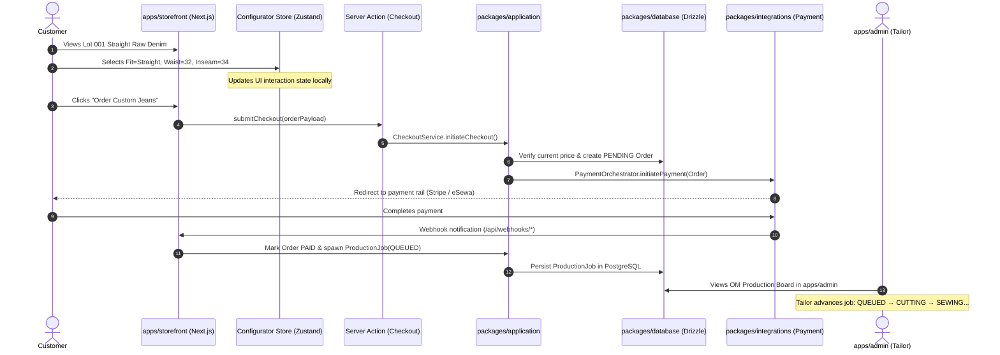

# JEANIUS — Precision Handmade Denim Works

> **Crafted in Kathmandu, Nepal. Worn Worldwide.**  
> A bespoke direct-to-consumer denim atelier and engineering platform built on Next.js, Supabase, Drizzle ORM, and Turborepo.

---

## 1. Brand & Commerce Overview

**Jeanius** bridges traditional artisanal denim craftsmanship with modern, resilient commerce architecture. Operating out of Kathmandu, Nepal, and serving a global audience of denim enthusiasts, the platform is engineered around three primary commerce models:

* **OM (Order-Made):** Custom jeans cut and assembled to order. Customers configure their exact physical specifications—fit, waist size, inseam length, stitching thread, and custom hardware. Production begins immediately upon payment verification, governed by a dynamic `ProductionPolicy` (lead times calculated live, excluding workshop holidays).
* **DROP (Ready-to-Ship):** Small-batch, curated runs of limited-edition jeans, denim tops, and selvedge accessories with immediate physical inventory reservation and distinct return/exchange policies.
* **TOGETHER & Membership:** Gated community releases, member-only drops, and archival projects with server-enforced access controls.

The customer interface follows a **restrained, minimalist editorial aesthetic**: generous whitespace, subtle tactile borders, Japanese raw-denim tones (deep indigo, unbleached ecru, selvedge red ticker line), and high-fidelity photography with zero generic ecommerce clutter.

---

## 2. Core Architecture & Tech Stack

The platform is designed as a **Domain-Driven Design (DDD) Modular Monolith** housed in a high-performance monorepo:

| Layer | Technology | Key Responsibility |
| :--- | :--- | :--- |
| **Monorepo Engine** | **Turborepo + pnpm** | Cached task orchestration, strict package boundaries, fast builds. |
| **Customer Storefront** | **Next.js App Router (React 19)** | High-speed Server Components, SEO metadata, editorial shop UI (`apps/storefront`). |
| **Workshop Admin Portal**| **Next.js App Router (React 19)** | Real-time OM manufacturing queue board, order management, inventory control (`apps/admin`). |
| **State Management** | **Zustand** | Ephemeral browser interaction only (cart drawer, active configurator selections). Server remains authoritative. |
| **Backend & APIs** | **Next.js Server Actions & Route Handlers** | Server Actions for application mutations; Route Handlers for external webhooks. No standalone microservice. |
| **Database & ORM** | **Supabase PostgreSQL + Drizzle ORM** | Type-safe SQL schemas, zero-cold-start queries, version-controlled migrations (`packages/database`). |
| **Contracts & Validation**| **Zod** | Shared schemas validating API payloads, forms, and external webhooks (`packages/contracts`). |
| **Payment Orchestrator** | **Multi-Rail Provider Gateway** | Provider abstraction routing international cards via **Stripe** and Nepal domestic rails via **eSewa / Khalti** (`packages/integrations`). |
| **Design System** | **@jeanius/ui** | Shared tokens (indigo, ecru, selvedge red) and minimal React components (`packages/ui`). |
| **Observability** | **Structured Logger** | Request correlation IDs, order state transitions, and audit tracing (`packages/observability`). |

---

## 3. Monorepo Directory Layout

```text
jeanius/
├── apps/
│   ├── storefront/                 # Customer-facing Next.js App Router webstore (Port 3000)
│   │   ├── app/                    # Catalog, Product Detail (/shop/[slug]), Cart, Checkout, Policies
│   │   ├── stores/                 # Zustand client stores (cart-store, configurator-store, ui-store)
│   │   └── package.json
│   └── admin/                      # Internal workshop & fulfillment Next.js application (Port 3001)
│       ├── app/                    # OM Manufacturing Pipeline Kanban, Orders, Inventory
│       └── package.json
│
├── packages/
│   ├── domain/                     # Pure TypeScript DDD entities & value objects (Zero external dependencies)
│   │   └── src/entities/           # Product, Variant, Cart, Order, ProductionJob, Money, Address
│   ├── application/                # Use cases, application services, and repository port interfaces
│   │   └── src/                    # CatalogService, CartService, CheckoutService, ProductionService
│   ├── database/                   # Supabase PostgreSQL + Drizzle ORM schemas and client
│   │   ├── src/schema/             # products, variants, orders, production_jobs tables
│   │   └── migrations/             # Generated SQL schema migrations
│   ├── contracts/                  # Zod validation schemas and shared DTO types
│   ├── integrations/               # External adapters: PaymentOrchestrator (Stripe & eSewa/Khalti)
│   ├── ui/                         # Design system tokens and shared React UI components
│   ├── config/                     # Typed server and client environment validation
│   ├── observability/              # Structured JSON logging and correlation context
│   └── testing/                    # Test fixtures and domain entity mock factories
│
├── infrastructure/
│   └── supabase/                   # Local Supabase Docker config.toml, seed data, and RLS policies
│
├── docs/
│   ├── architecture/               # Architecture diagrams and system overview
│   ├── adr/                        # Architecture Decision Records (ADR-001 to ADR-005)
│   └── product/                    # Complete product specifications and domain glossary
│
├── scripts/
│   └── verify-monorepo.sh          # One-step workspace compilation & verification script
├── .github/workflows/ci.yml        # Continuous integration pipeline (typecheck, lint, build)
├── turbo.json                      # Turborepo task pipeline configuration
├── pnpm-workspace.yaml             # Monorepo workspace package declarations
└── tsconfig.base.json              # Shared strict TypeScript compiler settings
```

---

## 4. System Architecture & Data Flow

All interactions follow strict unidirectional flow and inversion of control:



### Architectural Guardrails
1. **Domain Purity:** `@jeanius/domain` never imports React, Next.js, or database libraries.
2. **Repository Abstraction:** Application logic talks only to repository interfaces (`IProductRepository`, `IOrderRepository`). Direct SQL/Drizzle calls live exclusively inside `@jeanius/database`.
3. **Server Authority:** Zustand manages client UI state only (e.g. drawer open/close, active button toggles). Prices, inventory checks, discount calculations, and order creation are **always authoritative on the server**.

---

## 5. OM Manufacturing Pipeline

Unlike standard ecommerce, Jeanius operates a dedicated manufacturing workflow for custom orders:

```text
[1. QUEUED] ──► [2. CUTTING] ──► [3. SEWING] ──► [4. WASHING]
                                                       │
[8. SHIPPED] ◄── [7. READY] ◄── [6. QC INSPECTION] ◄── [5. HARDWARE]
```

* **Cutting:** Master artisan lays out Kurabo raw denim bolts, chalks custom measurements, and precision-cuts panels.
* **Sewing:** Union Special chainstitch construction, flat-felled inseams, and reinforced pocket bags.
* **Washing:** Optional one-wash bath to remove initial starch while preserving raw selvedge character.
* **Hardware:** Hand-hammered solid copper rivets and branded donut buttons.
* **QC Inspection:** Verification of measurements (tolerance: ±0.25") before packaging.

---

## 6. Developer Quickstart

### Prerequisites
* **Node.js:** `v22.x` or higher
* **pnpm:** `v11.x` (`corepack enable pnpm` or `npm install -g pnpm`)
* **Docker:** (Optional, for running local Supabase database via Supabase CLI)

### Installation & Setup

1. **Clone the repository:**
   ```bash
   git clone https://github.com/your-org/jeanius.git
   cd jeanius
   ```

2. **Install monorepo dependencies:**
   ```bash
   pnpm install
   ```

3. **Approve required native build scripts:**
   ```bash
   pnpm approve-builds --all
   ```

### Running Applications Locally

Start all workspace applications concurrently with Turborepo:
```bash
pnpm turbo run dev
```

* **Customer Storefront:** [http://localhost:3000](http://localhost:3000)
* **Workshop Admin Portal:** [http://localhost:3001](http://localhost:3001)

### Code Quality & Testing

```bash
# Typecheck all 11 workspace packages and applications
pnpm turbo run typecheck

# Build all packages and applications for production
pnpm turbo run build

# Run the complete automated monorepo verification script
./scripts/verify-monorepo.sh
```

---

## 7. Architecture Decision Records (ADRs)

Key architectural decisions are formally documented in [docs/adr/](file:///home/sarakb/projects/Jeanius/docs/adr):

* [ADR-001: Modular Monolith Architecture](file:///home/sarakb/projects/Jeanius/docs/adr/ADR-001-modular-monolith.md) — Rejecting premature microservices in favor of strict workspace packages.
* [ADR-002: Supabase PostgreSQL + Drizzle ORM](file:///home/sarakb/projects/Jeanius/docs/adr/ADR-002-drizzle-and-supabase.md) — Choosing lightweight, high-performance Drizzle over Prisma for serverless edge stability.
* [ADR-003: Zustand for Client-Side State Management](file:///home/sarakb/projects/Jeanius/docs/adr/ADR-003-zustand-client-state.md) — Enforcing strict separation between ephemeral UI state and server authority.
* [ADR-004: Next.js Server Boundary & API Strategy](file:///home/sarakb/projects/Jeanius/docs/adr/ADR-004-nextjs-server-boundary.md) — Utilizing Server Actions and Route Handlers instead of an independent API microservice.
* [ADR-005: Decoupled Payment Orchestrator Architecture](file:///home/sarakb/projects/Jeanius/docs/adr/ADR-005-payment-orchestrator.md) — Provider-independent multi-rail architecture supporting Nepal domestic and global payments.

---

## 8. Implementation Roadmap

The full production engineering backlog is tracked in [Production_Implementation.md](file:///home/sarakb/projects/Jeanius/Production_Implementation.md) across 42 states and ~600 tasks:

* **State 00:** Product Contract & Architecture Foundation
* **State 01:** Monorepo Foundation (`JN-028` – `JN-045`) — **DONE**
* **State 02:** Engineering Governance (`JN-046` – `JN-062`)
* **State 03:** Domain Model (`JN-063` – `JN-084`)
* **State 04–05:** Database Schema & Supabase Auth (`JN-085` – `JN-127`)
* **State 06–09:** Design System, Shell & Product Catalog (`JN-128` – `JN-179`)
* **State 10–15:** Core Commerce (Configurator, Zustand, Cart, Checkout, Payments, Orders)
* **State 16–19:** OM Manufacturing Pipeline & DROP Fulfillment
* **State 20–30:** Customer Portal, Admin Operations & Notifications
* **State 31–42:** Hardening, Security, SEO, Testing, and Production Launch

---

## 9. License & Craftsmanship

Proprietary and confidential. Developed for **Jeanius Handmade Denim Works**.  
All rights reserved © 2026.
