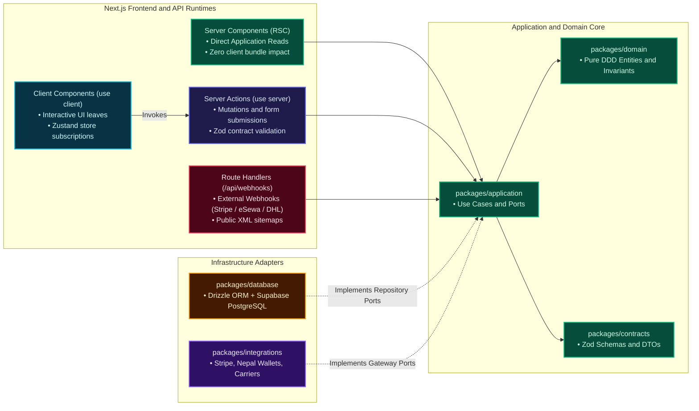

# ADR-004: Next.js Server Boundary & API Strategy

## Status
Accepted

## Deciders
Jeanius Core Engineering Team

## Date
2026-09-27

---

## Context and Problem Statement
When designing the ecommerce storefront (`apps/storefront`) and workshop admin portal (`apps/admin`), we evaluated whether to build an independent backend API microservice (e.g. `services/api` running Express, Fastify, or Hono) or leverage the native server capabilities of the Next.js App Router (React Server Components, Server Actions, and Route Handlers).

---

## Decision Drivers
- **Operational Simplicity:** Minimize the number of separate running processes, ports, Docker containers, and CI/CD deployment pipelines.
- **End-to-End Type Safety:** Direct function invocation between UI components and server use-cases with zero boilerplate serialization or code-generation steps.
- **Security & Secret Isolation:** Database credentials, Stripe secret keys, and Nepal digital wallet merchant secrets must never leak to the client browser.
- **Edge & Webhook Support:** Ability to receive external HTTP callbacks (Stripe webhooks, eSewa IPN callbacks) with raw body parsing for HMAC signature verification.

---

## Considered Options
1. **Standalone Backend API (Express / Hono / Fastify):** Maintain a separate `services/api` server. Next.js communicates with this server via HTTP REST or tRPC.
2. **Next.js App Router Server Boundaries (Server Actions + Route Handlers):** Use Next.js native server boundaries directly for all data mutations and webhooks, delegating to shared application packages.
3. **Supabase Direct Client Access:** Have the frontend query Supabase PostgreSQL directly using the Supabase client SDK and RLS.

---

## Decision Outcome
Chosen option: **Option 2 — Next.js App Router Server Boundaries (Server Actions + Route Handlers)**.

### Architectural Rules
1. **Server Actions for Mutations:** All internal state mutations initiated by user interaction (Add to Cart, Update Tailoring Specs, Submit Checkout, Transition Production Stage) run as Next.js Server Actions.
   - Server Actions run strictly on the server.
   - Server Actions validate input using Zod schemas from `packages/contracts`.
   - Server Actions immediately call use cases in `packages/application`.
2. **Route Handlers for External Callbacks:** Next.js Route Handlers (`app/api/**/route.ts`) are reserved strictly for external machine-to-machine integrations:
   - `/api/webhooks/stripe`: Stripe payment confirmation webhooks.
   - `/api/webhooks/esewa`: eSewa payment IPN callbacks.
   - `/api/health`: Synthetic uptime monitoring and deployment verification.
3. **No Direct Business Logic in Routes or Actions:** Server Actions and Route Handlers act purely as transport adaptors. They must never contain core business rules or raw database queries; they delegate immediately to `packages/application`.

```
[Browser Client]
       │
       │ (Server Action invocation)
       ▼
[Next.js Server Action] ──(Input Validation via Zod)──┐
       │                                              │
       ▼                                              │
[packages/application Use Case]                       ▼
       │                                    [packages/contracts]
       ├─────────────────────────┐
       ▼                         ▼
[packages/domain]      [packages/database / packages/integrations]
```

---

## Consequences

### Positive
- **Zero API Boilerplate:** Eliminates redundant REST endpoint boilerplate, API routing tables, and client fetching wrappers.
- **Single Process per App:** Storefront and Admin are self-contained deployable units that can be hosted on Vercel, Docker, or Node.js without managing separate backend servers.
- **Instant Latency Optimization:** Server Components fetch data directly in-process during server rendering, eliminating client-server round-trip waterfalls.

### Negative & Mitigations
- *Trade-off:* Third-party mobile apps (if built in the future) cannot call Server Actions directly.
- *Mitigation:* Because all business logic is encapsulated in `packages/application`, adding dedicated REST/tRPC Route Handlers for mobile apps in the future requires minimal effort without rewriting domain logic.

---

## Architectural & Code Verification
- Monorepo package: `apps/storefront/app/`, `apps/admin/app/`
- Reference: [ADR-001 Modular Monolith](file:///home/sarakb/projects/Jeanius/docs/adr/ADR-001-modular-monolith.md)

### Architectural Diagram



<details>
<summary>View Raw Diagram Source (.mmd)</summary>



</details>

