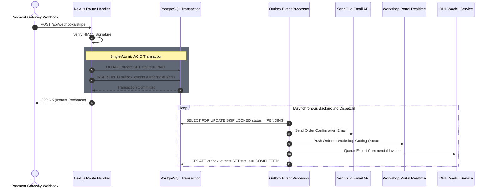

# ADR-007: Transactional Outbox Pattern for Asynchronous Events

## Status
Accepted

## Deciders
Jeanius Core Engineering Team

## Date
2026-09-27

---

## Context and Problem Statement
When critical state changes occur—such as an order being paid, a custom denim cut entering the `Sewing` stage, or a customer requesting a return—the system must trigger multiple side-effects across external and internal systems:
1. Dispatch transactional receipt emails via SendGrid / Resend.
2. Notify workshop tailors on internal dashboard channels.
3. Queue logistics waybill generation via DHL Express.
4. Record immutable ledger entries for accounting.

If an application route handler or Server Action updates the database and immediately calls third-party HTTP APIs directly, a **dual-write hazard** arises:
- If the database commit succeeds but the email service or shipping API throws a 500 error or network timeout, the external action is lost forever, or the route throws and leaves the caller in an ambiguous state.
- If the payment provider (Stripe, eSewa) retries the webhook because of the timeout, duplicate side-effects execute.

---

## Decision Drivers
- **Guaranteed At-Least-Once Delivery:** Every domain event must reliably trigger its downstream handlers, even during third-party API outages.
- **Zero Dual-Write Failures:** Database mutations and event emissions must be atomic.
- **Fast User-Facing Latency:** Checkout response times must not be blocked by slow third-party API network roundtrips.
- **Idempotency & Replayability:** Failed events can be inspected, debugged, and replayed from the database.

---

## Considered Options
1. **Direct Synchronous Calls in Handlers:** Call SendGrid, DHL, and internal services directly in the route handler. (Rejected: Fragile, high latency, causes webhook timeouts and duplicate execution).
2. **External Message Broker (RabbitMQ / Kafka):** Dual-write from Next.js to both Postgres and Kafka. (Rejected: Overkill for our modular monolith, still suffers from dual-write if the broker network fails).
3. **Transactional Outbox in PostgreSQL:** Write domain events to an `outbox_events` table inside the *same* database transaction as the business entity changes. A resilient worker consumes and dispatches outbox events asynchronously.

---

## Decision Outcome
Chosen option: **Option 3 — Transactional Outbox in PostgreSQL**.

### Implementation Architecture
1. **Atomic Outbox Write:**
   Within any use case in `packages/application`, when state changes occur, domain events are staged and written to `outbox_events` within the single ACID transaction:
   ```typescript
   await db.transaction(async (tx) => {
     await orderRepository.save(tx, order);
     await outboxRepository.append(tx, order.pullDomainEvents());
   });
   ```
2. **Outbox Event Schema:**
   - `id`: UUID (Primary Key)
   - `event_name`: String (e.g. `OrderPaidDomainEvent`, `GarmentStageChangedDomainEvent`)
   - `aggregate_id`: UUID
   - `payload`: JSONB
   - `status`: Enum (`PENDING`, `PROCESSING`, `COMPLETED`, `FAILED`)
   - `retry_count`: Integer
   - `last_error`: Text (nullable)
   - `created_at`, `processed_at`: Timestamps
3. **Outbox Processor:**
   - A lightweight asynchronous dispatcher (executed via scheduled runner or edge worker) fetches batches of `PENDING` events with row locking (`SELECT ... FOR UPDATE SKIP LOCKED`).
   - Dispatches events to registered event handlers (emails, webhooks, logistics).
   - Upon successful execution, marks status `COMPLETED`. On failure, increments `retry_count` with exponential backoff.

```
[Server Action / Webhook]
           │
           │ (Single ACID Transaction)
           ▼
┌──────────────────────────────────────┐
│        Supabase PostgreSQL          │
│  ┌───────────────┐  ┌──────────────┐ │
│  │    orders     │  │ outbox_events│ │
│  │ (Status=PAID) │  │   (PENDING)  │ │
│  └───────────────┘  └──────┬───────┘ │
└────────────────────────────┼─────────┘
                             │
                             ▼ (Poll / Trigger)
                  ┌──────────────────────┐
                  │   Outbox Processor   │
                  └──────────┬───────────┘
                             │
             ┌───────────────┼───────────────┐
             ▼               ▼               ▼
      [SendGrid Email]  [DHL Shipment] [Workshop Alert]
```

---

## Consequences

### Positive
- **Rock-Solid Consistency:** Business state and outbound events are atomically locked together; zero orphaned actions.
- **Sub-100ms API Responses:** Webhooks and checkout actions return immediately after the database commit without waiting for slow email or shipping HTTP APIs.
- **Auditable System Event Log:** The `outbox_events` table acts as a historical trace of all critical actions in the platform.

### Negative & Mitigations
- *Trade-off:* Introduces slight eventual consistency for side-effects (e.g. receipt email lands 1–3 seconds after payment confirmation).
- *Mitigation:* This is standard across top ecommerce platforms and is vastly superior to broken transactions.

---

## Architectural & Code Verification
- Schema Table: `packages/database/src/schema/outbox.schema.ts`
- Port: `packages/application/src/ports/outbox-repository.port.ts`
- Reference: [ADR-001 Modular Monolith](file:///home/sarakb/projects/Jeanius/docs/adr/ADR-001-modular-monolith.md)

### Architectural Diagram


<details>
<summary>View Raw Diagram Source (.mmd)</summary>



</details>

