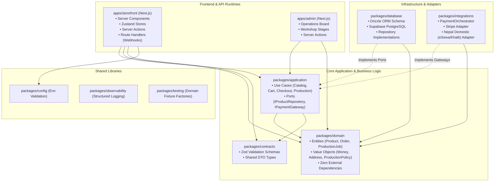

# JEANIUS — ARCHITECTURE & COMPONENT WALKTHROUGH

This document explains the internal structure of the Jeanius monorepo, detailing **what talks to what**, **where the APIs and business logic reside**, and **how the frontend and backend communicate**.

---

## 1. High-Level Dependency Graph (What Talks to What?)

The codebase is structured as a **Domain-Driven Design (DDD) Modular Monolith** using Turborepo and pnpm workspaces:



<details>
<summary>View Diagram Source (Mermaid)</summary>



</details>

---

## 2. Where Are the APIs?

There is **no standalone Express or Hono server** (`services/api`). The backend runs directly within Next.js App Router and Supabase:

### A. Next.js Server Actions (Internal RPCs)
* **Location:** Inside `apps/storefront` and `apps/admin` (e.g. `app/actions/cart.ts`, `app/actions/checkout.ts`, `app/actions/production.ts`).
* **Purpose:** Handle user actions directly from UI components without needing manual `fetch()` endpoints.
* **Mechanism:**
  1. The client invokes a TypeScript function with the `"use server"` directive.
  2. The action validates inputs using Zod schemas from [packages/contracts](file:///home/sarakb/projects/Jeanius/packages/contracts).
  3. The action calls a use-case service in [packages/application](file:///home/sarakb/projects/Jeanius/packages/application).
  4. Returns strongly typed results directly to the React component.

### B. Next.js Route Handlers (External Webhooks & REST)
* **Location:** `apps/storefront/app/api/webhooks/stripe/route.ts` and `apps/storefront/app/api/webhooks/nepal-gateway/route.ts`.
* **Purpose:** Receive asynchronous callbacks from external payment providers when a customer completes payment.
* **Mechanism:**
  1. Payment provider posts webhook payload to `/api/webhooks/stripe`.
  2. Route handler invokes `PaymentOrchestrator.verifyWebhook()` in [packages/integrations](file:///home/sarakb/projects/Jeanius/packages/integrations).
  3. Dispatches order confirmation use-case in [packages/application](file:///home/sarakb/projects/Jeanius/packages/application).

### C. Supabase Edge Functions (Optional Isolated Boundaries)
* **Location:** `infrastructure/supabase/functions/` (if scheduled cron jobs or edge tasks outside Next.js are needed).

---

## 3. Which Part Has the Business Logic?

Business logic is strictly separated into two distinct layers:

### Layer 1: Core Domain Rules — [packages/domain](file:///home/sarakb/projects/Jeanius/packages/domain)
* **What it is:** Pure TypeScript business entities, value objects, and domain invariants. **Zero dependencies** on React, Next.js, Supabase, or Drizzle.
* **What lives here:**
  * **Entities:** `Product`, `ProductVariant`, `Cart`, `Order`, `ProductionJob`.
  * **Value Objects:**
    * `Money`: Always represented in minor units (e.g., cents or paisa) with explicit currency to prevent floating-point rounding errors.
    * `Address`: Postal, regional, and international shipping structure.
    * `ProductionPolicy`: Manages dynamic manufacturing lead times (e.g., 7–14 days, excluded holiday calendars) so deadlines are never hard-coded.
  * **Domain Invariants:**
    * OM (Order-Made) jeans cannot be cancelled or refunded once cutting has begun.
    * DROP products decrement physical inventory; OM products spawn a manufacturing work order.

### Layer 2: Application Use Cases — [packages/application](file:///home/sarakb/projects/Jeanius/packages/application)
* **What it is:** Application orchestrators (Commands and Queries) that coordinate entities, database repositories, and integrations.
* **What lives here:**
  * `CatalogService`: Resolves products by slug and filters published items.
  * `CartService`: Calculates subtotals and verifies configuration compatibility.
  * `CheckoutService`: Coordinates pending orders and inventory locks.
  * `ProductionService`: Enforces state machine transitions for workshop jobs (`QUEUED` → `CUTTING` → `SEWING` → `WASHING` → `HARDWARE` → `QC` → `READY` → `SHIPPED`).
  * **Port Interfaces (Inversion of Control):** `IProductRepository`, `ICartRepository`, `IOrderRepository`, `IPaymentGateway`.

---

## 4. Frontend Architecture: Storefront & Admin

### Customer Storefront — [apps/storefront](file:///home/sarakb/projects/Jeanius/apps/storefront)
* **Next.js Server Components (Default):**
  * Product pages (`/shop/[slug]`), catalog listings, brand guides, sizing charts.
  * Rendered on the server directly fetching from `CatalogService` without sending unnecessary JavaScript to the client.
* **Zustand Client Stores ([apps/storefront/stores](file:///home/sarakb/projects/Jeanius/apps/storefront/stores)):**
  * [configurator-store.ts](file:///home/sarakb/projects/Jeanius/apps/storefront/stores/configurator-store.ts): Tracks customer selections (fit, waist, inseam).
  * [cart-store.ts](file:///home/sarakb/projects/Jeanius/apps/storefront/stores/cart-store.ts): Controls the mini-cart drawer overlay and animation.
  * [ui-store.ts](file:///home/sarakb/projects/Jeanius/apps/storefront/stores/ui-store.ts): Controls mobile navigation drawer and search modal.
  * *Important:* Zustand never stores authoritative prices or stock counts. All purchasing operations submit to the server.

### Workshop Operations Portal — [apps/admin](file:///home/sarakb/projects/Jeanius/apps/admin)
* **Purpose:** Dedicated workshop portal for master craftsmen and fulfillment staff.
* **Key Modules:**
  * **OM Production Board:** Visual queue tracking every custom pair of jeans through each workshop stage.
  * **Inventory Manager:** Tracking raw fabric rolls (Kurabo, Kuroki selvedge) and DROP batch quantities.
  * **Order Fulfillment:** Generating international waybills and recording carrier tracking numbers.

---

## 5. End-to-End Walkthrough: The Order-Made (OM) Purchase Journey

Here is how data flows through the entire system when a customer purchases custom jeans:

```text
1. BROWSE:
   Customer opens /shop/lot-001
   └── apps/storefront Server Component calls CatalogService (packages/application)
       └── Database queries Supabase via ProductRepository (packages/database)
           └── Renders product facts and raw denim weight (14oz Japanese Kurabo)

2. CONFIGURE:
   Customer selects: Fit=Straight, Waist=32, Inseam=34
   └── apps/storefront/stores/configurator-store.ts (Zustand) tracks selections locally in UI
       └── UI renders dynamic option summary and active lead-time estimate

3. ADD TO CART & CHECKOUT:
   Customer clicks "Checkout"
   └── Calls Server Action submitCheckout()
       └── Validates input with CreateCheckoutSchema (packages/contracts)
       └── CheckoutService (packages/application) creates Order in "PENDING" state
       └── Calls PaymentOrchestrator (packages/integrations)
           ├── If USD/International -> StripePaymentAdapter initiates Stripe Checkout Session
           └── If NPR/Domestic      -> NepalDomesticPaymentAdapter initiates eSewa/Khalti flow
       └── Customer redirected to payment gateway

4. PAYMENT WEBHOOK:
   Payment gateway completes transaction and fires webhook
   └── apps/storefront/app/api/webhooks/stripe/route.ts receives webhook
       └── PaymentOrchestrator verifies cryptographic signature
       └── Order status transitions to "PAID"
       └── Spawns ProductionJob entity in "QUEUED" stage with target deadline

5. WORKSHOP EXECUTION:
   Workshop craftsman logs into apps/admin
   └── Sees new job on the OM Production Board under "QUEUED"
   └── Craftsman clicks "Begin Cutting" -> calls transitionStage("CUTTING") Server Action
       └── ProductionService updates job status in packages/database
       └── Customer receives automated email notification: "Denim Cut Underway"
```
