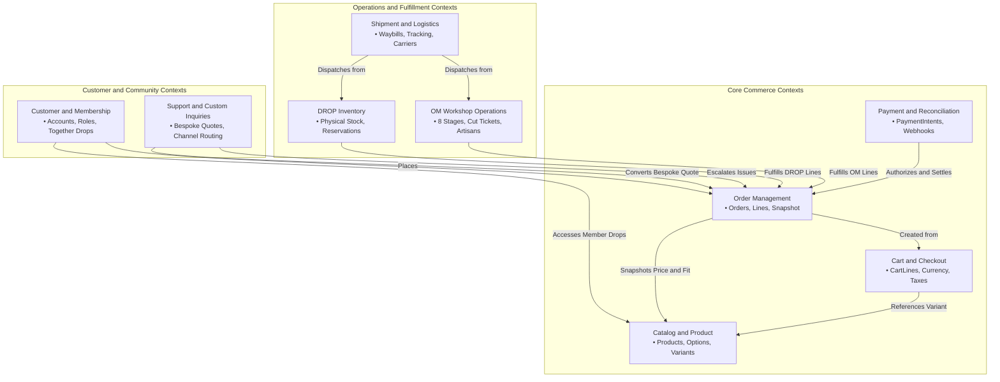
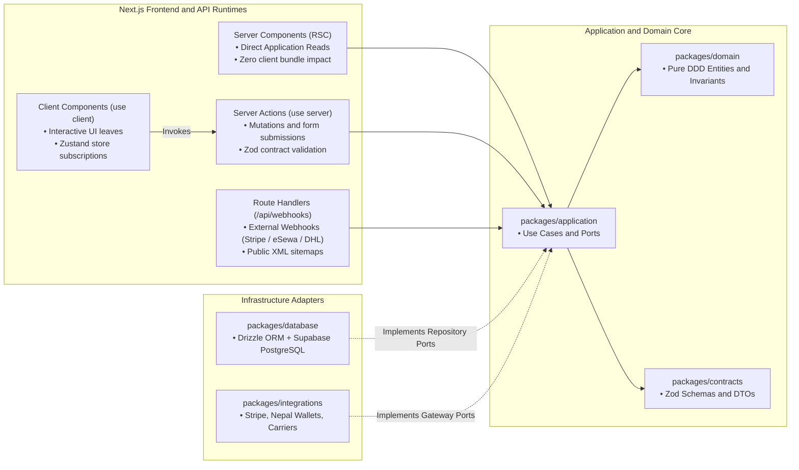

# JEANIUS — DOMAIN MAP & ARCHITECTURAL BOUNDARIES (JN-016 to JN-019)

## 1. Subdomain Map & Bounded Contexts (JN-016)

The Jeanius platform is architected as a **Domain-Driven Design (DDD) Modular Monolith**. Business capabilities are decomposed into 8 distinct Bounded Contexts, each maintaining its own ubiquitous language, domain models, and business invariants:



### Bounded Context Catalog

| Bounded Context | Core Responsibility | Key Domain Entities & Value Objects | Upstream Dependencies |
| :--- | :--- | :--- | :--- |
| **Catalog & Product** | Product catalog management, fit configurations, fabric specs, and scheduled releases. | `Product`, `ProductOption`, `OptionValue`, `Variant`, `ScheduledRelease` | None (Independent) |
| **Cart & Checkout** | Ephemeral shopping session state, line configuration validation, tax & currency conversion. | `Cart`, `CartLine`, `Money`, `SelectedOptions` | Catalog (Read-Only) |
| **Order Management** | Authoritative commercial contracts formed after payment, immutable item snapshots. | `Order`, `OrderLine`, `ShippingAddress`, `OrderStatus` | Cart, Payment, Customer |
| **Payment & Billing** | Multi-rail payment intents (Stripe USD / eSewa NPR), webhook processing, financial audit. | `PaymentIntent`, `PaymentTransaction`, `ReconciliationRecord` | Order (Amount & Reference) |
| **OM Manufacturing** | Workshop job queuing across 8 artisanal stations, Cut Ticket generation, tailor assignment. | `ProductionJob`, `ProductionStage`, `CutTicket`, `Artisan`, `DefectLog` | Order (OM Lines) |
| **DROP Inventory** | Pre-manufactured batch inventory staging, atomic reservations, warehouse restock. | `InventoryItem`, `StockReservation`, `BatchCount` | Order (DROP Lines) |
| **Shipment & Logistics**| Courier waybill registration (DHL/Aramex/Nepal Post), international customs, tracking. | `Shipment`, `Waybill`, `CarrierTracking`, `CustomsDeclaration` | Production, Inventory |
| **Customer & Member** | Account security, authentication profiles, Together drop authorization privileges. | `CustomerProfile`, `MembershipTier`, `AccessPermission` | None |
| **Support & Inquiries** | Bespoke custom-order quotes, Instagram inquiry routing, SLA escalation tracking. | `CustomOrderInquiry`, `BespokeQuote`, `SupportTicket` | Customer, Order |

---

## 2. Inter-Domain Dependency Graph & Communication Rules (JN-017)

To preserve modularity and prevent the monorepo from decaying into a "big ball of mud", strict dependency and communication rules are enforced:

### A. Context Relationship Matrix

| Upstream Context | Downstream Context | Relationship Pattern | Integration Mechanism |
| :--- | :--- | :--- | :--- |
| **Catalog** | **Cart & Checkout** | Customer / Supplier | Direct read via `ICatalogQueryService` |
| **Cart** | **Order Management** | Customer / Supplier | Cart converted to immutable Order via `CreateOrder` use case |
| **Order Management** | **OM Manufacturing** | Shared Kernel (Order IDs) | Dispatched via `OrderPaidDomainEvent` |
| **Order Management** | **DROP Inventory** | Customer / Supplier | Atomic reservation confirmed upon `OrderPaidDomainEvent` |
| **Order Management** | **Payment & Billing** | Conformist | Order specifies target amount and currency; Payment handles rails |
| **OM Manufacturing** | **Shipment** | Downstream Consumer | Workshop Stage 7 (`READY`) emits event triggering shipment staging |
| **DROP Inventory** | **Shipment** | Downstream Consumer | Order paid event allocates stock and triggers warehouse packing slip |

### B. Forbidden Architectural Dependencies
1. **No Circular Imports:** Under no circumstances may `Order Management` import from `Shipment` or `Payment` directly. Information flows downstream or through domain events.
2. **Immutable Snapshots over Live Joins:** The `Order` domain **never** joins live product pricing from `Catalog`. When an order is placed, an immutable `OrderLineSnapshot` freezes the title, SKU, fit dimensions, selected options, fabric weight, and price in minor units. Future price edits to the catalog cannot mutate historical orders.
3. **Domain Event Decoupling:** Cross-context state updates (such as an order advancing to production upon payment confirmation) are coordinated through typed `DomainEvent` handlers within `packages/application`, rather than direct transactional database cross-writes.

---

## 3. Architectural Boundaries & Port/Adapter Inversion of Control (JN-018)

Jeanius strictly adheres to **Clean Architecture** (Hexagonal Architecture / Ports & Adapters) to protect core business logic from framework and infrastructure changes:

```text
┌────────────────────────────────────────────────────────────────────────┐
│                        FRAMEWORKS & RUNTIMES                           │
│  apps/storefront (Next.js 15)            apps/admin (Next.js 15)       │
│  • React Server Components (RSC)         • Operations Kanban Board     │
│  • Server Actions ("use server")         • Workshop Stage Advance      │
│  • Route Handlers (Webhooks)             • Tailor Terminal             │
└───────────────────────────────────┬────────────────────────────────────┘
                                    │
                                    ▼
┌────────────────────────────────────────────────────────────────────────┐
│                          APPLICATION LAYER                             │
│  packages/application                                                  │
│  • Use Cases: Checkout, AdvanceProductionStage, RegisterShipment       │
│  • Inbound/Outbound Ports (Interfaces):                                │
│    - IProductRepository       - IOrderRepository                       │
│    - IPaymentGateway          - IShipmentCarrierAdapter                │
└───────────────────┬────────────────────────────────▲───────────────────┘
                    │                                │
                    ▼                                │ (Implements Ports)
┌──────────────────────────────────────┐  ┌──────────┴───────────────────┐
│             DOMAIN CORE              │  │    INFRASTRUCTURE ADAPTERS   │
│  packages/domain (Pure TypeScript)   │  │  packages/database (Drizzle) │
│  • Entities: Product, Order, Job     │  │  packages/integrations       │
│  • Value Objects: Money, Address     │  │  • Stripe / eSewa Gateways   │
│  • Invariants & State Validators     │  │  • DHL / Aramex Adapters     │
│  • Zero External Dependencies        │  │  • Resend Email Adapter      │
└──────────────────────────────────────┘  └──────────────────────────────┘
```

### Architectural Enforcement Rules
1. **Domain Purity Rule:** `packages/domain` contains zero imports of ORMs (`drizzle-orm`), databases (`@supabase/supabase-js`), UI frameworks (`react`, `next`), or payment SDKs (`stripe`). Domain code is compiled to pure JavaScript and executable anywhere.
2. **Port/Adapter Boundary:** Domain use cases define repository and gateway interfaces (Ports) in `packages/application`. Infrastructure packages (`packages/database` and `packages/integrations`) implement these interfaces (Adapters).
3. **Contract Boundary:** Incoming HTTP payloads, Server Action arguments, and webhook bodies are validated at the monorepo perimeter using Zod schemas from `packages/contracts` before reaching domain entities.

---

## 4. Next.js Server / Client Runtime Boundary Matrix (JN-019)

In the Next.js App Router, code execution is partitioned into four clear runtime boundaries to balance SEO, security, zero bundle overhead, and rich interactivity:



### Runtime Responsibility Matrix

| Runtime Layer | Directive / Convention | Permitted Responsibilities | Prohibited Actions |
| :--- | :--- | :--- | :--- |
| **Server Components (RSC)** | Default (No directive) | Database queries via Application layer, SEO metadata, reading session cookies, static HTML streaming. | `useState`, `useEffect`, event listeners (`onClick`), mutating data directly. |
| **Client Components** | `"use client"` | 3D garment fit customizer, interactive cart drawer, Zustand subscriptions, drag-and-drop Kanban. | Direct SQL queries, importing server secrets, holding authoritative business logic. |
| **Server Actions** | `"use server"` | Form submissions, cart mutations, workshop stage advance, checkout initiation, path revalidation. | Returning raw database rows without DTO mapping, executing unvalidated inputs. |
| **Route Handlers** | `app/api/*/route.ts` | External provider webhooks (Stripe, eSewa, DHL), public sitemaps, RSS feeds. | Internal UI data fetching (use RSC instead to eliminate roundtrips). |

### Caching & Revalidation Strategy
1. **Dynamic Workshop State:** Admin operational dashboards bypass Data Cache (`dynamic = 'force-dynamic'`) to ensure workshop tailors view real-time stage progression.
2. **Product Catalog:** Editorial product pages utilize ISR (`revalidate = 3600`) with targeted tag revalidation (`revalidateTag('catalog')`) triggered by Admin product updates.
3. **Cart & Checkout:** Strictly dynamic per-user session, managed authoritatively via Server Actions and persisted via encrypted session cookies or Supabase database records.
