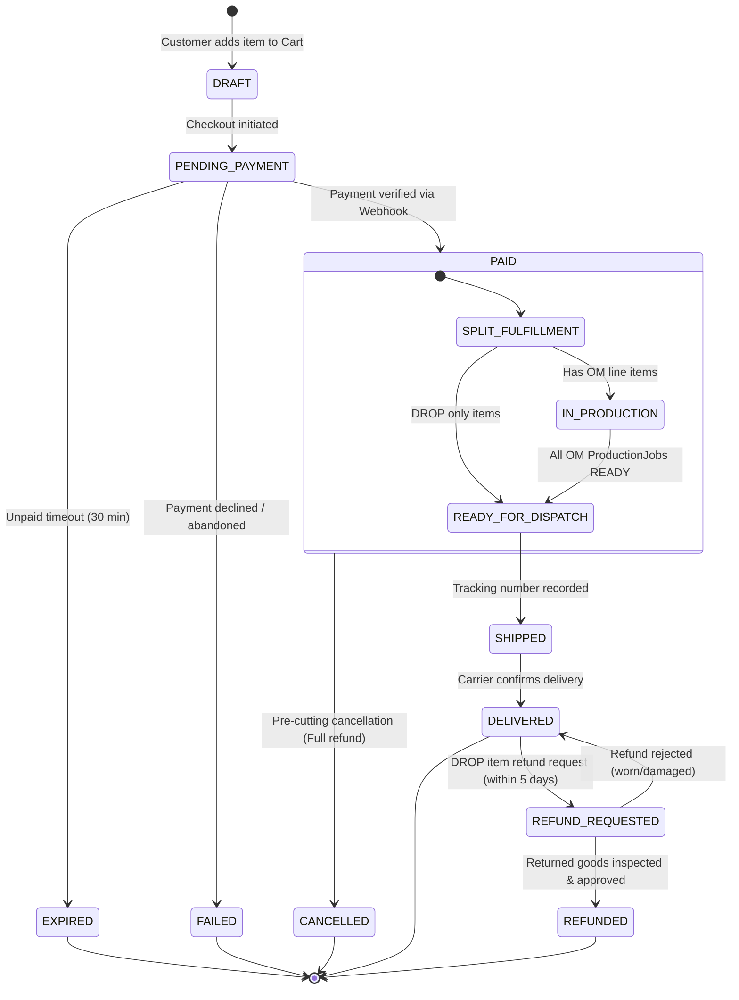
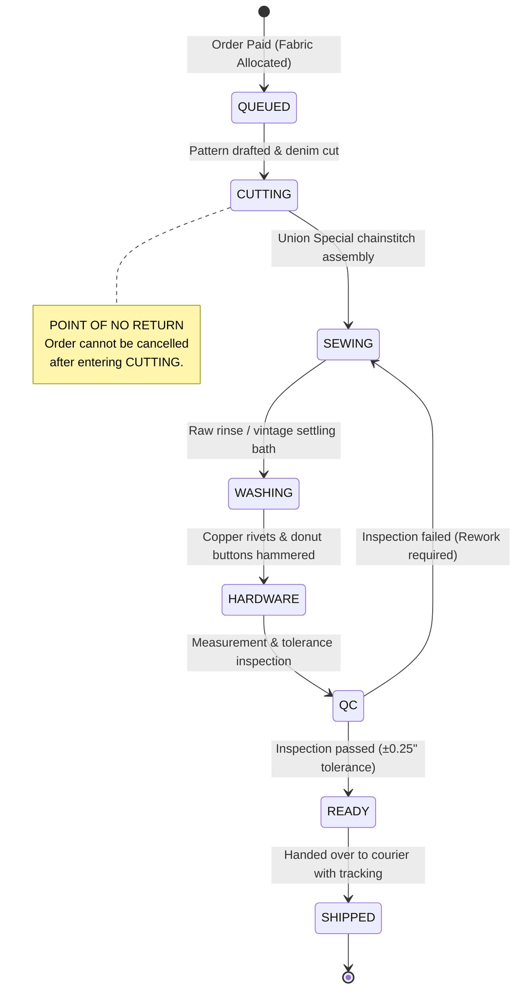
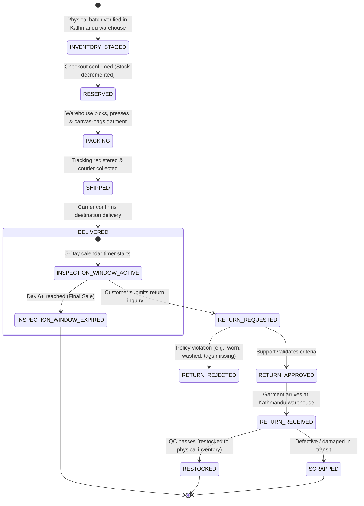
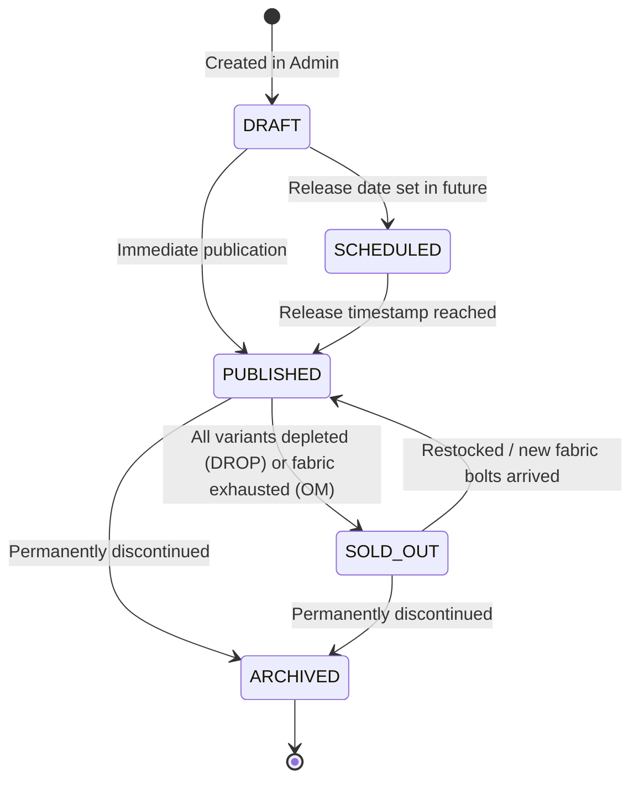
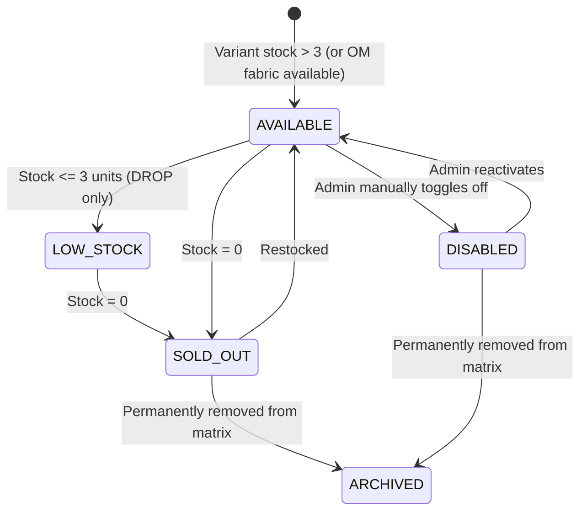
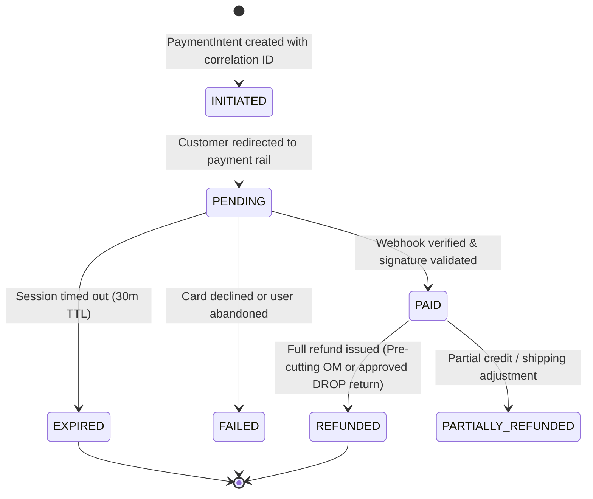

# JEANIUS — PRODUCT CONTRACT & SPECIFICATION

**Document Version:** 1.0.0  
**Status:** Frozen Implementation Contract  
**Scope:** Foundational Architecture Contracts (JN-001 to JN-005)

---

## 1. Product Scope Matrix (JN-001)

The scope for Jeanius is strictly defined across three tiers to guarantee focus on high-craft execution and prevent scope creep.

| Feature Area | MVP (Launch Target) | Phase 2 (Fast Follow) | Explicitly Excluded |
| :--- | :--- | :--- | :--- |
| **Catalog & Models** | • Order-Made (OM) Jeans, Jackets, Tote Bags • Small-batch Ready-to-Ship (DROP) • Dynamic OM lead-time badge | • Gated community drops (TOGETHER) • Pre-orders for upcoming fabric lots | • Multi-vendor marketplace • Digital goods / NFTs |
| **Product Configurator** | • Fit, Waist (28–36), Inseam (30–36) • Raw rinse vs One-wash selection • Hardware finishes (Brass, Silver) | • Custom chainstitch monogramming • Bespoke pocket bag artwork | • 3D real-time mesh rendering (distracting to minimalist aesthetic) |
| **Checkout & Payments** | • Single-page international address validation • Multi-rail payment (Stripe USD card rails + Nepal domestic eSewa/Khalti NPR rails) • Dynamic shipping calculation | • Split payments • Multi-currency crypto rails | • Unauthenticated / guest checkout without email confirmation |
| **Workshop & Operations** | • 8-Stage OM Production Kanban in `apps/admin` • Cut-ticket generation & fabric batch tracking • Delay recording & notes | • Automated barcode/QR label scanning • Fabric bolt waste optimization | • Heavy third-party ERP integration (SAP, Oracle) |
| **Fulfillment & Logistics** | • Manual tracking number assignment • Courier status synchronization (DHL / Aramex / EMS) • Military-base shipping rules | • Automated shipping rate API integration (EasyPost/Shippo) • Local pickup locker network | • Dropshipping from unverified third-party suppliers |
| **Customer Experience** | • Order tracking & OM timeline visualization • Editorial guide (Sizing, Denim Care, About) • Direct Instagram DM / Email support | • Verified purchase reviews with photo upload • Community denim fading gallery | • AI chatbot customer support |

---

## 2. Formalized Commerce Models (JN-002)

### A. Order-Made (OM) — Made to Order
* **Core Principle:** Jeans, jackets, and accessories cut and assembled after customer payment.
* **Inventory Behavior:** Zero finished goods inventory required. Orders lock reservations on raw fabric yardage (e.g. 2.7m of 14oz Kurabo raw selvedge denim).
* **Production Policy:** Governed dynamically by `ProductionPolicy` (default: 7–14 business days, automatically extending for official Nepal workshop holidays).
* **Cancellation & Refund Contract:**
  * **Pre-Cutting:** The customer may cancel within 24 hours of payment if the job has not entered the `CUTTING` stage (100% refund).
  * **Post-Cutting (Point of No Return):** Once the tailor draws the pattern and precision-cuts the denim panels to the customer's waist and inseam, cancellation or return is **strictly prohibited**, except in cases of proven manufacturing defect.

### B. DROP — Ready-to-Ship
* **Core Principle:** Pre-manufactured physical inventory produced in limited batches (e.g., 50 units of a limited natural indigo capsule).
* **Inventory Behavior:** Variant inventory count decrements immediately upon checkout confirmation. Once inventory hits 0, variant transitions to `SOLD_OUT`.
* **Fulfillment Window:** Dispatches from the Kathmandu warehouse within 24–48 hours.
* **Return & Refund Contract:** Customers have a 5-day inspection window from the carrier delivery timestamp. Returned goods must be unworn, with tags and selvedge ticker intact.

### C. Custom Atelier Inquiries (Bespoke)
* **Core Principle:** Personalized, non-standard denim requests (custom patch placements, specialized heavyweights > 19oz).
* **Workflow:** Non-payable inquiry submitted via storefront form → Admin reviews and issues formal quote (Price + Lead Time) → Customer accepts and pays → Converts into standard OM order.

### D. TOGETHER — Member-Only Releases
* **Core Principle:** Protected, small-batch denim releases accessible only to authenticated members or designated access pass holders.
* **Security Guardrail:** Server Components enforce authorization before serving product metadata or images, preventing media scraping.

---

## 3. Actor Model & Permissions (JN-003)

| Actor Role | Authentication | Permitted Capabilities | Prohibited Operations |
| :--- | :--- | :--- | :--- |
| **GUEST** | None (Anonymous session) | Browse public catalog, configure denim options, calculate shipping rates, add items to cart. | Cannot place orders without email, access TOGETHER drops, or view order history. |
| **CUSTOMER** | Authenticated (Email/Password) | Place orders, view personal order history, inspect live OM stage status, save shipping addresses. | Cannot view workshop boards, manipulate prices, or access internal production notes. |
| **MEMBER** | Authenticated + Member Flag | All Customer capabilities + access to restricted `TOGETHER` and archival drops. | Cannot access administrative features. |
| **TAILOR** | Authenticated + Tailor Role | Access `apps/admin` OM queue, inspect cutting tickets, advance production stages, record delay notes. | Cannot alter product prices, view customer credit card details, or issue financial refunds. |
| **FULFILLMENT** | Authenticated + Fulfillment Role | Access ready orders in `apps/admin`, package orders, generate waybills, record carrier tracking numbers. | Cannot modify product configurations or advance tailoring stages. |
| **SUPPORT** | Authenticated + Support Role | Search orders, view customer history, update shipping addresses prior to dispatch, resolve tickets. | Cannot modify database schemas or execute raw database updates. |
| **ADMIN** | Authenticated + Admin Role | Full operational control: manage catalog, configure `ProductionPolicy`, adjust stock, issue refunds. | None. |

---

## 4. Order Lifecycle State Machine (JN-004)

Every commercial transaction follows an immutable state machine:

### State Definitions & Rules
1. **DRAFT:** Ephemeral cart state.
2. **PENDING_PAYMENT:** Order created with frozen line items and locked price snapshot. A payment session is active.
3. **PAID:** Payment confirmed by verified webhook. If OM lines are present, a `ProductionJob` is created for each custom line item.
4. **IN_PRODUCTION:** At least one OM line item is actively in the manufacturing queue.
5. **READY_FOR_DISPATCH:** Items inspected, pressed, and packed into branded canvas tote bags with maker certificates.
6. **SHIPPED:** Dispatched with an international tracking number (e.g. DHL Express, Aramex).
7. **DELIVERED:** Courier signals delivery to destination address.

---

## 5. OM Manufacturing Lifecycle (JN-005)

The craftsmanship pipeline is the heart of Jeanius. Every pair of custom jeans progresses through eight mandatory stages:

### Workshop Stage Details
1. **STAGE 1 — QUEUED:** Order received. Tailor allocates raw denim roll (e.g., 14oz Japanese Kurabo selvedge) and prepares pattern cards.
2. **STAGE 2 — CUTTING:** **[POINT OF NO RETURN]** Fabric is rolled out, chalked to customer's exact waist and inseam, and precision-cut. Cancellation is locked.
3. **STAGE 3 — SEWING:** Construction using vintage Union Special chainstitch machines, flat-felled inseams, hidden back pocket rivets, and reinforced belt loops.
4. **STAGE 4 — WASHING:** Optional one-wash bath to remove sizing starch while preserving raw selvedge rigidity and vertical indigo fading potential.
5. **STAGE 5 — HARDWARE:** Solid copper burr rivets hand-hammered onto stress points; custom donut buttons pressed; vegetable-tanned leather patch branded and stitched.
6. **STAGE 6 — QC INSPECTION:** Senior artisan verifies waist, front rise, back rise, thigh, knee, and leg opening against specifications (tolerance: ±0.25").
7. **STAGE 7 — READY:** Passed garments folded, ironed, and packaged into dustproof canvas bags with signed artisan maker certificates.
8. **STAGE 8 — SHIPPED:** Tracking number registered and transit updates initiated.

---

## 6. DROP Lifecycle & Return Policy (JN-006)

Unlike Order-Made garments, DROP products represent limited physical batches manufactured and stored in the Kathmandu workshop warehouse before release.

### DROP Return Policy Rules
1. **5-Day Inspection Window:** The customer has exactly 5 calendar days from the carrier-verified delivery timestamp to file a return request. On day 6, the sale becomes final and non-refundable.
2. **Condition Requirements:** The garment must be completely unwashed, unworn, and retain original pocket flashers, selvedge ticker lines, and branded leather tags.
3. **Restocking Workflow:** Approved returns must be physically inspected by warehouse QC before entering `RESTOCKED` status or issuing financial refund credits.

---

## 7. Product Lifecycle & Visibility Matrix (JN-007)

Every editorial style in the Jeanius catalog progresses through an explicit lifecycle governing catalog visibility, search engine indexing, and purchasing availability:

### Catalog Visibility Matrix

| Status | Storefront Catalog | Direct URL Access | Search Engine Indexing (Robots) | Purchasing Actions (Buy Now / Add to Cart) |
| :--- | :--- | :--- | :--- | :--- |
| **DRAFT** | Hidden | 404 (Admin Preview Only) | `noindex, nofollow` | Blocked |
| **SCHEDULED**| Visible as "Coming Soon" | Allowed (Countdown Active) | `index, follow` | Blocked until `publishAt <= now()` |
| **PUBLISHED**| Visible | Allowed | `index, follow` | Enabled |
| **SOLD_OUT** | Visible with "Sold Out" badge | Allowed | `index, follow` | Blocked (Restock Notification Available) |
| **ARCHIVED** | Hidden from index | Allowed for order history only | `noindex, nofollow` | Blocked permanently |

---

## 8. Variant Matrix & Inventory Lifecycle (JN-008)

A **Variant** represents a concrete, purchasable combination of options (e.g. Lot 001, Fit=Straight, Waist=32, Inseam=34).

### Matrix Resolution & Invariants
1. **Independent Option Availability:** Individual option values (e.g., Waist 32 in Slim Fit) can transition to `SOLD_OUT` independently. The configurator dynamically disables unavailable combinations without marking the entire product sold out.
2. **Product-Level Sold Out Invariant:** A Product transitions to `SOLD_OUT` if and only if **all** of its purchasable variants are in `SOLD_OUT` or `DISABLED` states.
3. **Inventory Race Protection:** DROP variant inventory is checked server-side with atomic SQL decrement during checkout to prevent overselling.

---

## 9. Payment Lifecycle & Provider Reconciliation (JN-009)

The payment domain operates entirely on internal `PaymentIntent` records decoupled from external gateway implementations:

### Reconciliation & Multi-Rail Rules
1. **Multi-Rail Routing:**
   * **International Rail (USD):** Dispatched to Stripe Checkout (Cards, Apple Pay).
   * **Nepal Domestic Rail (NPR):** Dispatched to domestic digital wallets (eSewa, Khalti, Fonepay).
2. **Display vs. Settlement Separation:** Storefront displays customer currency (USD / EUR / NPR); merchant settlement occurs in the rail's native currency.
3. **Webhook Idempotency:** Webhook handlers record the gateway's event ID in an audit log. Duplicate webhook callbacks return `200 OK` immediately without re-triggering order state transitions.

---

## 10. OM Production Operations & Cut Ticket Specs (JN-010)

Entering the `CUTTING` stage generates an immutable, printable **Cut Ticket** work order for the workshop tailor:

### Cut Ticket Specification
* **Job Identification:** `jobId`, `orderNumber`, `orderLineId`, `artisanAssigned`.
* **Pattern Measurements:** Custom Fit (Straight / Slim / Relaxed), Waist circumference (inches), Front Rise, Back Rise, Knee, Inseam length, Leg opening.
* **Denim Specifications:** Fabric roll lot (e.g., Kurabo 14oz Pink Selvedge), shrinkage allowance applied (+3% for raw rinse).
* **Hardware & Thread:** Thread color (Tobacco / Indigo / Gold), button metal (Antique Brass / Solid Silver), pocket bag cloth.
* **Timestamps & SLA:** `orderPaidAt`, `targetCompletionDate` (calculated from `ProductionPolicy`).

### Delay Escalation & Rework Protocols
1. **Delay Management:** If a job encounters a bottleneck (e.g., custom button stockout), the tailor records a formal `delayReason` and estimated revised completion date, automatically notifying support.
2. **QC Rework Protocol:** If a garment fails the Stage 6 QC inspection (tolerance exceeded > ±0.25"), it is transitioned back to `SEWING` with a tagged defect note rather than discarded.
