# JEANIUS & JEWL — PRODUCT CONTRACT & SPECIFICATION

**Document Version:** 1.1.0  
**Status:** Frozen Implementation Contract  
**Scope:** Foundational Architecture Contracts (JN-001 to JN-005)

---

## 1. Product Scope Matrix (JN-001)

The scope for Jeanius & Jewl is strictly defined across three tiers to guarantee focus on high-craft execution across both denim and jewellery verticals:

| Feature Area | MVP (Launch Target) | Phase 2 (Fast Follow) | Explicitly Excluded |
| :--- | :--- | :--- | :--- |
| **Catalog & Models** | • Order-Made (OM) Jeans, Jackets, Sterling Silver Rings, Denim Wallet Chains<br/>• Small-batch Ready-to-Ship (DROP) denim jackets, brass cuffs, bags<br/>• Dynamic OM lead-time badge | • Gated community drops (TOGETHER)<br/>• Pre-orders for upcoming fabric lots & rare gemstone gems | • Multi-vendor marketplace<br/>• Digital goods / NFTs |
| **Product Configurator** | • Denim: Fit, Waist (28–36), Inseam (30–36), Raw/One-wash, Thread<br/>• Jewellery: Ring Size (US 4–14), Chain Length, Metal Alloy, Finish, Engraving | • Custom chainstitch monogramming<br/>• Bespoke pocket bag artwork & gemstone settings | • 3D real-time mesh rendering (distracting to minimalist aesthetic) |
| **Checkout & Payments** | • Single-page international address validation<br/>• Multi-rail payment (Stripe USD card rails + Nepal domestic eSewa/Khalti NPR rails)<br/>• Dynamic shipping calculation | • Split payments<br/>• Multi-currency crypto rails | • Unauthenticated / guest checkout without email confirmation |
| **Workshop & Operations** | • 8-Stage OM Production Kanban in `apps/admin`<br/>• Cut-ticket (Denim) & Bench-ticket (Jewellery) tracking<br/>• Delay recording & notes | • Automated barcode/QR label scanning<br/>• Raw metal scrap recycling & yardage optimization | • Heavy third-party ERP integration (SAP, Oracle) |
| **Fulfillment & Logistics** | • Manual tracking number assignment<br/>• Courier status synchronization (DHL / Aramex / EMS)<br/>• Military-base shipping rules | • Automated shipping rate API integration (EasyPost/Shippo)<br/>• Local pickup locker network | • Dropshipping from unverified third-party suppliers |
| **Customer Experience** | • Order tracking & OM timeline visualization<br/>• Editorial guide (Sizing for Denim & Rings, Denim/Jewellery Care)<br/>• Direct Instagram DM / Email support | • Verified purchase reviews with photo upload<br/>• Community denim & silver fading gallery | • AI chatbot customer support |

---

## 2. Formalized Commerce Models (JN-002)

### A. Order-Made (OM) — Made to Order
* **Core Principle:** Garments and jewellery pieces custom cut, sewn, cast, or forged only after customer payment.
* **Denim Material & Continuity:**
  * Zero finished goods inventory required. Orders lock reservations on raw fabric yardage on discrete continuous **Fabric Bolts** (e.g. 2.7m of 14oz Kurabo raw selvedge denim).
  * **Continuous Yardage Invariant:** Selvedge denim is woven on narrow shuttle looms (28–31 inches wide). Garment panels for a single pair of jeans **must be cut from a single, continuous fabric bolt** to preserve patina fade and weave consistency.
* **Jewellery Material & Bench Fabrication:**
  * Rings, chains, and hardware are individually cast, sized on steel mandrels, hand-finished, and stamped with official atelier hallmarks (.925 Silver, Solid Brass).
* **Production Policy:** Governed dynamically by `ProductionPolicy` (default: 7–14 business days, automatically extending for official Nepal workshop holidays).
* **Cancellation & Refund Contract:**
  * **Pre-Crafting:** The customer may cancel within 24 hours of payment if the job has not entered the `CUTTING` / `FORGING` stage (100% refund).
  * **Post-Crafting (Point of No Return):** Once the tailor precision-cuts the denim panels or the metalsmith sizes and engraves the ring band, cancellation or return is **strictly prohibited**, except in cases of proven manufacturing defect.

### B. DROP — Ready-to-Ship
* **Core Principle:** Pre-manufactured physical inventory produced in limited numbered batches (e.g., 50 selvedge jackets, 25 hand-forged brass cuffs).
* **Inventory Behavior:** Variant inventory count decrements immediately upon checkout confirmation. Once inventory hits 0, variant transitions to `SOLD_OUT`.
* **Fulfillment Window:** Dispatches from the Kathmandu atelier within 24–48 hours.
* **Return & Refund Contract:** Customers have a 5-day inspection window from the carrier delivery timestamp. Returned goods must be unworn, undamaged, with original tags, hallmarks, and packaging intact.

### C. Custom Atelier Inquiries (Bespoke)
* **Core Principle:** Personalized, non-standard denim requests (custom patch placements, specialized heavyweights > 19oz).
* **Workflow:** Non-payable inquiry submitted via storefront form → Admin reviews and issues formal quote (Price + Lead Time) → Customer accepts and pays → Converts into standard OM order.

### D. TOGETHER — Member-Only Releases
* **Core Principle:** Protected, small-batch denim releases accessible only to authenticated members or designated access pass holders.
* **Security Guardrail:** Server Components enforce authorization before serving product metadata or images, preventing media scraping.

---

## 3. Actor Model & Permissions (JN-003)

| Actor Role | Authentication | Permitted Capabilities | Prohibited Operations |
| :--- | :--- | :--- | :--- |
| **GUEST** | None (Anonymous session) | Browse public catalog, configure denim options, calculate shipping rates, add items to cart. | Cannot place orders without email, access TOGETHER drops, or view order history. |
| **CUSTOMER** | Authenticated (Email/Password) | Place orders, view personal order history, inspect live OM stage status, save shipping addresses. | Cannot view workshop boards, manipulate prices, or access internal production notes. |
| **MEMBER** | Authenticated + Member Flag | All Customer capabilities + access to restricted `TOGETHER` and archival drops. | Cannot access administrative features. |
| **TAILOR** | Authenticated + Tailor Role | Access `apps/admin` OM queue, inspect cutting tickets, advance production stages, record delay notes. | Cannot alter product prices, view customer credit card details, or issue financial refunds. |
| **FULFILLMENT** | Authenticated + Fulfillment Role | Access ready orders in `apps/admin`, package orders, generate waybills, record carrier tracking numbers. | Cannot modify product configurations or advance tailoring stages. |
| **SUPPORT** | Authenticated + Support Role | Search orders, view customer history, update shipping addresses prior to dispatch, resolve tickets. | Cannot modify database schemas or execute raw database updates. |
| **ADMIN** | Authenticated + Admin Role | Full operational control: manage catalog, configure `ProductionPolicy`, adjust stock, issue refunds. | None. |

---

## 4. Order Lifecycle State Machine (JN-004)

Every commercial transaction follows an immutable state machine supporting multi-package split fulfillment:



<details>
<summary>View Diagram Source (Mermaid)</summary>

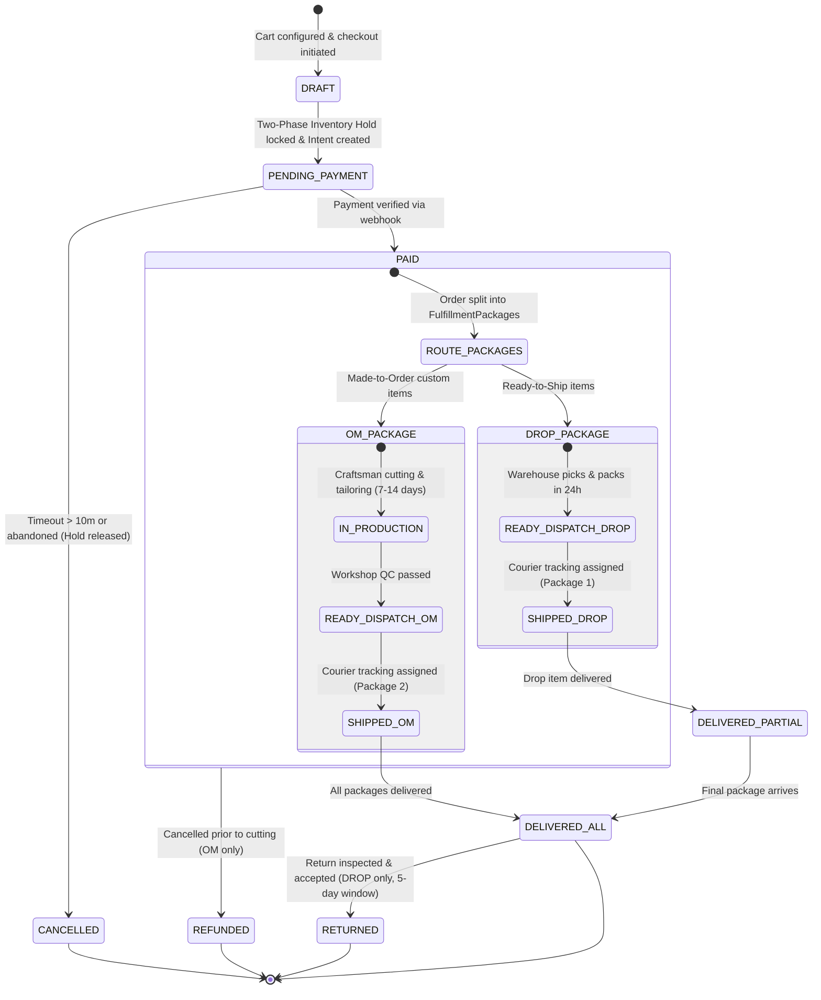
```mermaid
stateDiagram-v2
    [*] --> DRAFT: Cart configured & checkout initiated
    DRAFT --> PENDING_PAYMENT: Two-Phase Inventory Hold locked & Intent created
    PENDING_PAYMENT --> PAID: Payment verified via webhook
    PENDING_PAYMENT --> CANCELLED: Timeout > 10m or abandoned (Hold released)
    
    state PAID {
        [*] --> ROUTE_PACKAGES: Order split into FulfillmentPackages
        ROUTE_PACKAGES --> DROP_PACKAGE: Ready-to-Ship items
        ROUTE_PACKAGES --> OM_PACKAGE: Made-to-Order custom items
        
        state DROP_PACKAGE {
            [*] --> READY_DISPATCH_DROP: Warehouse picks & packs in 24h
            READY_DISPATCH_DROP --> SHIPPED_DROP: Courier tracking assigned (Package 1)
        }
        
        state OM_PACKAGE {
            [*] --> IN_PRODUCTION: Craftsman cutting & tailoring (7-14 days)
            IN_PRODUCTION --> READY_DISPATCH_OM: Workshop QC passed
            READY_DISPATCH_OM --> SHIPPED_OM: Courier tracking assigned (Package 2)
        }
    }
    
    SHIPPED_DROP --> DELIVERED_PARTIAL: Drop item delivered
    SHIPPED_OM --> DELIVERED_ALL: All packages delivered
    DELIVERED_PARTIAL --> DELIVERED_ALL: Final package arrives
    
    PAID --> REFUNDED: Cancelled prior to cutting (OM only)
    DELIVERED_ALL --> RETURNED: Return inspected & accepted (DROP only, 5-day window)
    
    CANCELLED --> [*]
    REFUNDED --> [*]
    RETURNED --> [*]
    DELIVERED_ALL --> [*]
```

</details>

### State Definitions & Rules
1. **DRAFT:** Ephemeral cart state.
2. **PENDING_PAYMENT:** Order created with frozen line items and locked price snapshot. A 10-minute Two-Phase Inventory Hold is actively reserved.
3. **PAID:** Payment confirmed by verified webhook. If OM lines are present, a `ProductionJob` is created for each custom line item.
4. **MULTI-PACKAGE SPLIT FULFILLMENT:**
   - Orders containing both ready-to-ship DROP items and custom Order-Made garments split into independent `FulfillmentPackage`s.
   - **Package 1 (DROP):** Dispatches from Kathmandu warehouse within 24–48 hours via DHL Express.
   - **Package 2 (OM):** Dispatches upon completing all 8 workshop production stages (7–14 days).
5. **SHIPPED:** Courier tracking numbers assigned to respective packages.
6. **DELIVERED_ALL:** All packages delivered to customer.

---

## 5. OM Manufacturing Lifecycle (JN-005)

The craftsmanship pipeline is the heart of Jeanius. Every pair of custom jeans progresses through eight mandatory stages:



<details>
<summary>View Diagram Source (Mermaid)</summary>

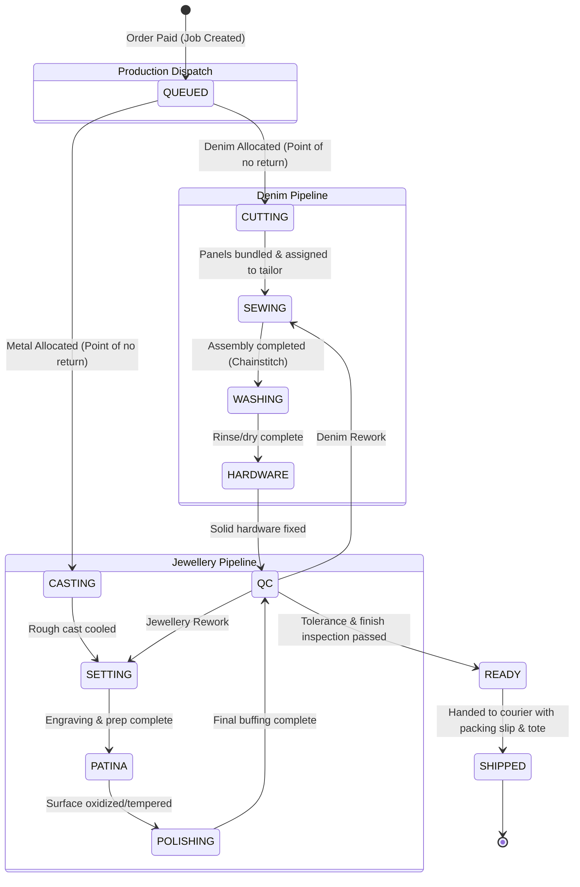
```mermaid
stateDiagram-v2
    [*] --> QUEUED: Order Paid (Job Created)
    
    state "Production Dispatch" as dispatch {
        QUEUED
    }
    
    QUEUED --> CUTTING: Denim Allocated (Point of no return)
    QUEUED --> CASTING: Metal Allocated (Point of no return)
    
    state "Denim Pipeline" as denim {
        CUTTING --> SEWING: Panels bundled & assigned to tailor
        SEWING --> WASHING: Assembly completed (Chainstitch)
        WASHING --> HARDWARE: Rinse/dry complete
        HARDWARE --> QC: Solid hardware fixed
    }
    
    state "Jewellery Pipeline" as jewl {
        CASTING --> SETTING: Rough cast cooled
        SETTING --> PATINA: Engraving & prep complete
        PATINA --> POLISHING: Surface oxidized/tempered
        POLISHING --> QC: Final buffing complete
    }
    
    QC --> READY: Tolerance & finish inspection passed
    QC --> SEWING: Denim Rework
    QC --> SETTING: Jewellery Rework
    
    READY --> SHIPPED: Handed to courier with packing slip & tote
    SHIPPED --> [*]
```

</details>

### Workshop Stage Details (Denim Pipeline)
1. **STAGE 1 — QUEUED:** Order received. Tailor allocates raw denim roll.
2. **STAGE 2 — CUTTING:** **[POINT OF NO RETURN]** Fabric is rolled out, chalked, and precision-cut. Cancellation is locked.
3. **STAGE 3 — SEWING:** Construction using vintage Union Special chainstitch machines.
4. **STAGE 4 — WASHING:** Optional one-wash bath to remove sizing starch.
5. **STAGE 5 — HARDWARE:** Solid copper burr rivets and custom donut buttons hammered.
6. **STAGE 6 — QC INSPECTION:** Measurement and tolerance inspection.
7. **STAGE 7 — READY:** Passed garments folded and packaged into dustproof canvas bags.
8. **STAGE 8 — SHIPPED:** Tracking number registered.

### Workshop Stage Details (Jewellery Pipeline)
1. **STAGE 1 — QUEUED:** Order received. Jeweller allocates precious metal stock (.925 Silver, Solid Brass).
2. **STAGE 2 — CASTING:** **[POINT OF NO RETURN]** Metal is melted and cast into the rough shape. Cancellation is locked.
3. **STAGE 3 — SETTING:** Ring sizing on mandrel, stamping, and any stone setting.
4. **STAGE 4 — PATINA:** Chemical oxidation or heat tempering applied for vintage finishes.
5. **STAGE 5 — POLISHING:** Final buffing and polishing (Mirror or Matte).
6. **STAGE 6 — QC INSPECTION:** Weight, size, and hallmark inspection.
7. **STAGE 7 — READY:** Passed pieces placed in protective boxes.
8. **STAGE 8 — SHIPPED:** Tracking number registered.

---

## 6. DROP Lifecycle & Return Policy (JN-006)

Unlike Order-Made garments, DROP products represent limited physical batches manufactured and stored in the Kathmandu workshop warehouse before release.



<details>
<summary>View Diagram Source (Mermaid)</summary>

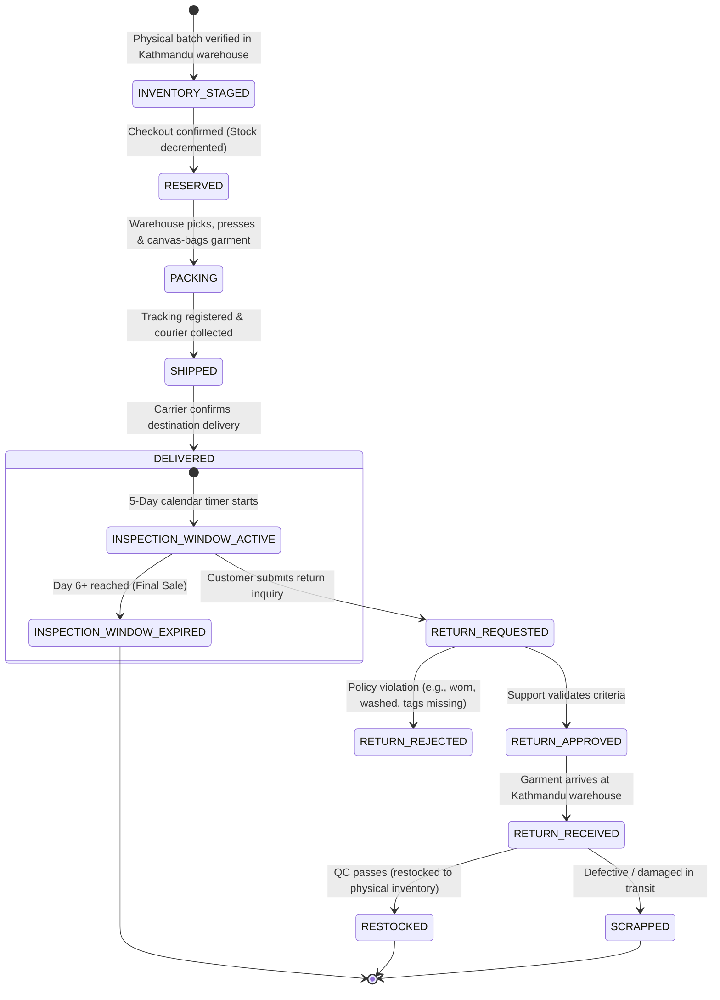
```mermaid
stateDiagram-v2
    [*] --> INVENTORY_STAGED: Physical batch verified in Kathmandu warehouse
    INVENTORY_STAGED --> RESERVED: Checkout confirmed (Stock decremented)
    RESERVED --> PACKING: Warehouse picks, presses & canvas-bags garment
    PACKING --> SHIPPED: Tracking registered & courier collected
    SHIPPED --> DELIVERED: Carrier confirms destination delivery
    
    state DELIVERED {
        [*] --> INSPECTION_WINDOW_ACTIVE: 5-Day calendar timer starts
        INSPECTION_WINDOW_ACTIVE --> INSPECTION_WINDOW_EXPIRED: Day 6+ reached (Final Sale)
    }
    
    INSPECTION_WINDOW_ACTIVE --> RETURN_REQUESTED: Customer submits return inquiry
    RETURN_REQUESTED --> RETURN_APPROVED: Support validates criteria
    RETURN_REQUESTED --> RETURN_REJECTED: Policy violation (e.g., worn, washed, tags missing)
    RETURN_APPROVED --> RETURN_RECEIVED: Garment arrives at Kathmandu warehouse
    RETURN_RECEIVED --> RESTOCKED: QC passes (restocked to physical inventory)
    RETURN_RECEIVED --> SCRAPPED: Defective / damaged in transit
    
    INSPECTION_WINDOW_EXPIRED --> [*]
    RESTOCKED --> [*]
    SCRAPPED --> [*]
```

</details>

### DROP Return Policy Rules
1. **5-Day Inspection Window:** The customer has exactly 5 calendar days from the carrier-verified delivery timestamp to file a return request. On day 6, the sale becomes final and non-refundable.
2. **Condition Requirements:** The garment must be completely unwashed, unworn, and retain original pocket flashers, selvedge ticker lines, and branded leather tags.
3. **Restocking Workflow:** Approved returns must be physically inspected by warehouse QC before entering `RESTOCKED` status or issuing financial refund credits.

---

## 7. Product Lifecycle & Visibility Matrix (JN-007)

Every editorial style in the Jeanius catalog progresses through an explicit lifecycle governing catalog visibility, search engine indexing, and purchasing availability:



<details>
<summary>View Diagram Source (Mermaid)</summary>

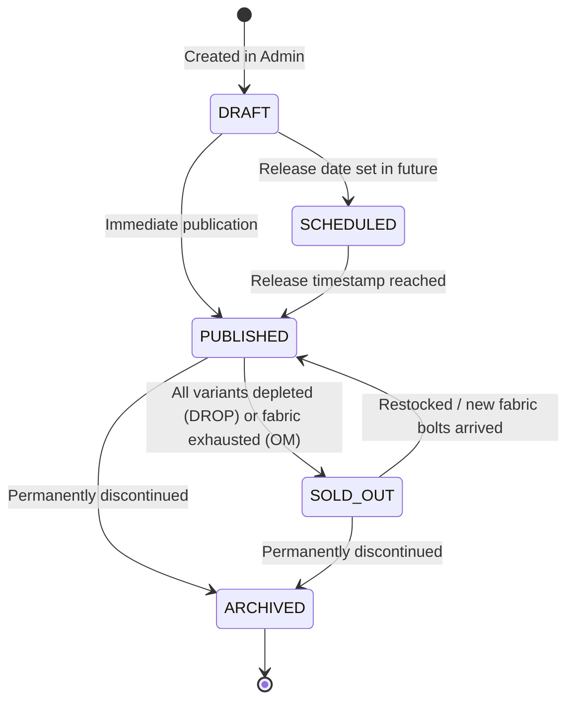
```mermaid
stateDiagram-v2
    [*] --> DRAFT: Created in Admin
    DRAFT --> SCHEDULED: Release date set in future
    DRAFT --> PUBLISHED: Immediate publication
    SCHEDULED --> PUBLISHED: Release timestamp reached
    PUBLISHED --> SOLD_OUT: All variants depleted (DROP) or fabric exhausted (OM)
    SOLD_OUT --> PUBLISHED: Restocked / new fabric bolts arrived
    PUBLISHED --> ARCHIVED: Permanently discontinued
    SOLD_OUT --> ARCHIVED: Permanently discontinued
    ARCHIVED --> [*]
```

</details>

### Catalog Visibility Matrix

| Status | Storefront Catalog | Direct URL Access | Search Engine Indexing (Robots) | Purchasing Actions (Buy Now / Add to Cart) |
| :--- | :--- | :--- | :--- | :--- |
| **DRAFT** | Hidden | 404 (Admin Preview Only) | `noindex, nofollow` | Blocked |
| **SCHEDULED**| Visible as "Coming Soon" | Allowed (Countdown Active) | `index, follow` | Blocked until `publishAt <= now()` |
| **PUBLISHED**| Visible | Allowed | `index, follow` | Enabled |
| **SOLD_OUT** | Visible with "Sold Out" badge | Allowed | `index, follow` | Blocked (Restock Notification Available) |
| **ARCHIVED** | Hidden from index | Allowed for order history only | `noindex, nofollow` | Blocked permanently |

---

## 8. Variant Matrix & Inventory Lifecycle (JN-008)

A **Variant** represents a concrete, purchasable combination of options (e.g. Lot 001, Fit=Straight, Waist=32, Inseam=34).



<details>
<summary>View Diagram Source (Mermaid)</summary>

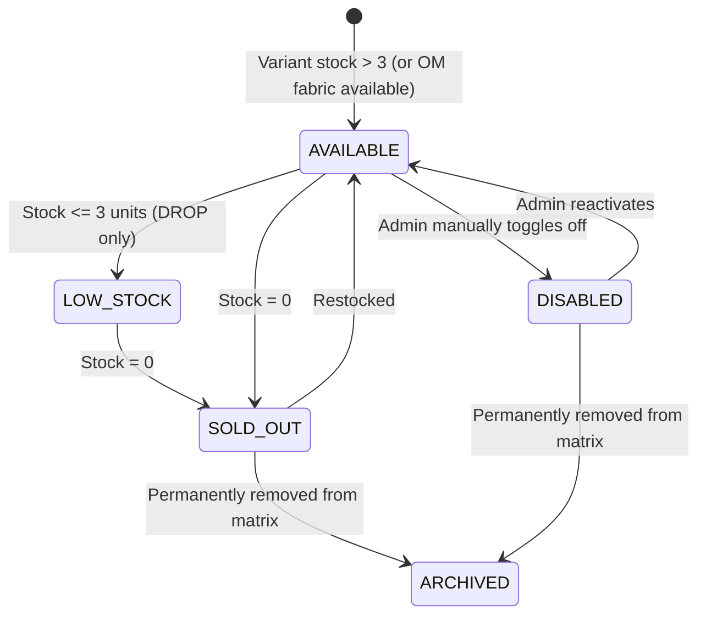
```mermaid
stateDiagram-v2
    [*] --> AVAILABLE: Variant stock > 3 (or OM fabric available)
    AVAILABLE --> LOW_STOCK: Stock <= 3 units (DROP only)
    LOW_STOCK --> SOLD_OUT: Stock = 0
    AVAILABLE --> SOLD_OUT: Stock = 0
    AVAILABLE --> DISABLED: Admin manually toggles off
    DISABLED --> AVAILABLE: Admin reactivates
    SOLD_OUT --> AVAILABLE: Restocked
    SOLD_OUT --> ARCHIVED: Permanently removed from matrix
    DISABLED --> ARCHIVED: Permanently removed from matrix
```

</details>

### Matrix Resolution & Invariants
1. **Independent Option Availability:** Individual option values (e.g., Waist 32 in Slim Fit) can transition to `SOLD_OUT` independently. The configurator dynamically disables unavailable combinations without marking the entire product sold out.
2. **Product-Level Sold Out Invariant:** A Product transitions to `SOLD_OUT` if and only if **all** of its purchasable variants are in `SOLD_OUT` or `DISABLED` states.
3. **Inventory Race Protection (Two-Phase Hold):** DROP variant inventory is protected by a two-phase atomic reservation (Claim + 10-minute TTL) to prevent overselling on limited selvedge drops.

---

## 8.B Two-Phase Inventory Hold (Claim + TTL) Architecture

During high-concurrency limited drop launches (e.g. 50 pairs of Japanese selvedge denim), the platform enforces an atomic reservation workflow before payment:

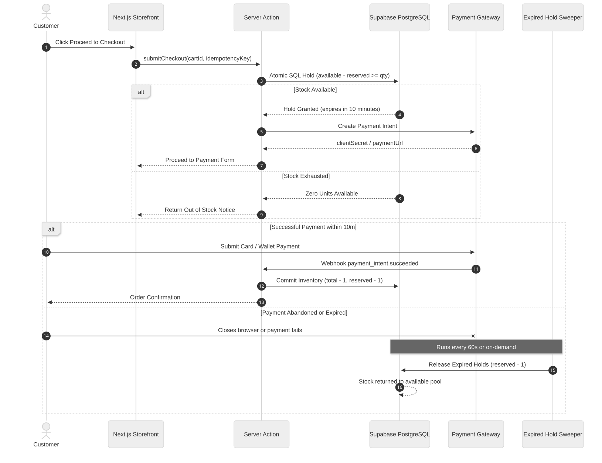

<details>
<summary>View Diagram Source (Mermaid)</summary>

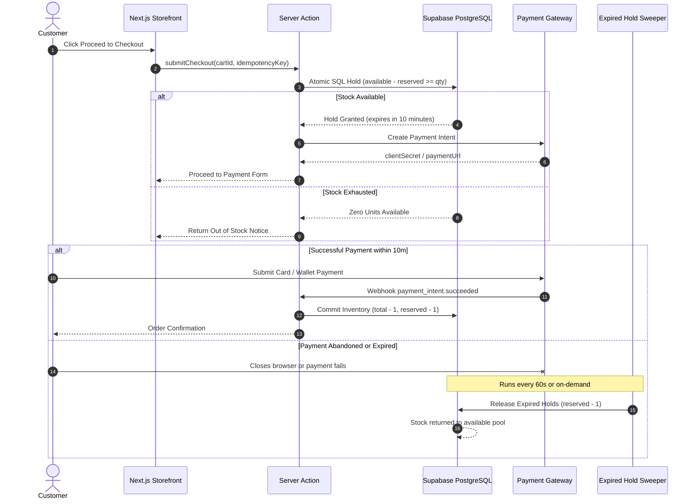
```mermaid
sequenceDiagram
    autonumber
    actor Customer
    participant Storefront as Next.js Storefront
    participant ServerAction as Server Action
    participant Database as Supabase PostgreSQL
    participant Gateway as Payment Gateway
    participant Sweeper as Expired Hold Sweeper

    Customer->>Storefront: Click Proceed to Checkout
    Storefront->>ServerAction: submitCheckout(cartId, idempotencyKey)
    ServerAction->>Database: Atomic SQL Hold (available - reserved >= qty)
    alt Stock Available
        Database-->>ServerAction: Hold Granted (expires in 10 minutes)
        ServerAction->>Gateway: Create Payment Intent
        Gateway-->>ServerAction: clientSecret / paymentUrl
        ServerAction-->>Storefront: Proceed to Payment Form
    else Stock Exhausted
        Database-->>ServerAction: Zero Units Available
        ServerAction-->>Storefront: Return Out of Stock Notice
    end

    alt Successful Payment within 10m
        Customer->>Gateway: Submit Card / Wallet Payment
        Gateway->>ServerAction: Webhook payment_intent.succeeded
        ServerAction->>Database: Commit Inventory (total - 1, reserved - 1)
        ServerAction-->>Customer: Order Confirmation
    else Payment Abandoned or Expired
        Customer-xGateway: Closes browser or payment fails
        Note over Sweeper,Database: Runs every 60s or on-demand
        Sweeper->>Database: Release Expired Holds (reserved - 1)
        Database-->>Database: Stock returned to available pool
    end
```

</details>

### Two-Phase Invariants
1. **Conditional Atomic Hold:** Soft claims succeed only if `available_quantity - reserved_quantity >= requested_qty`.
2. **Deterministic Expiration:** Uncompleted reservations expire in exactly 10 minutes, returning reserved stock to the available drop pool.
3. **Zero Overselling:** No payment intent is generated without an active, validated reservation token.

---

## 9. Payment Lifecycle & Provider Reconciliation (JN-009)

The payment domain operates entirely on internal `PaymentIntent` records decoupled from external gateway implementations:



<details>
<summary>View Diagram Source (Mermaid)</summary>

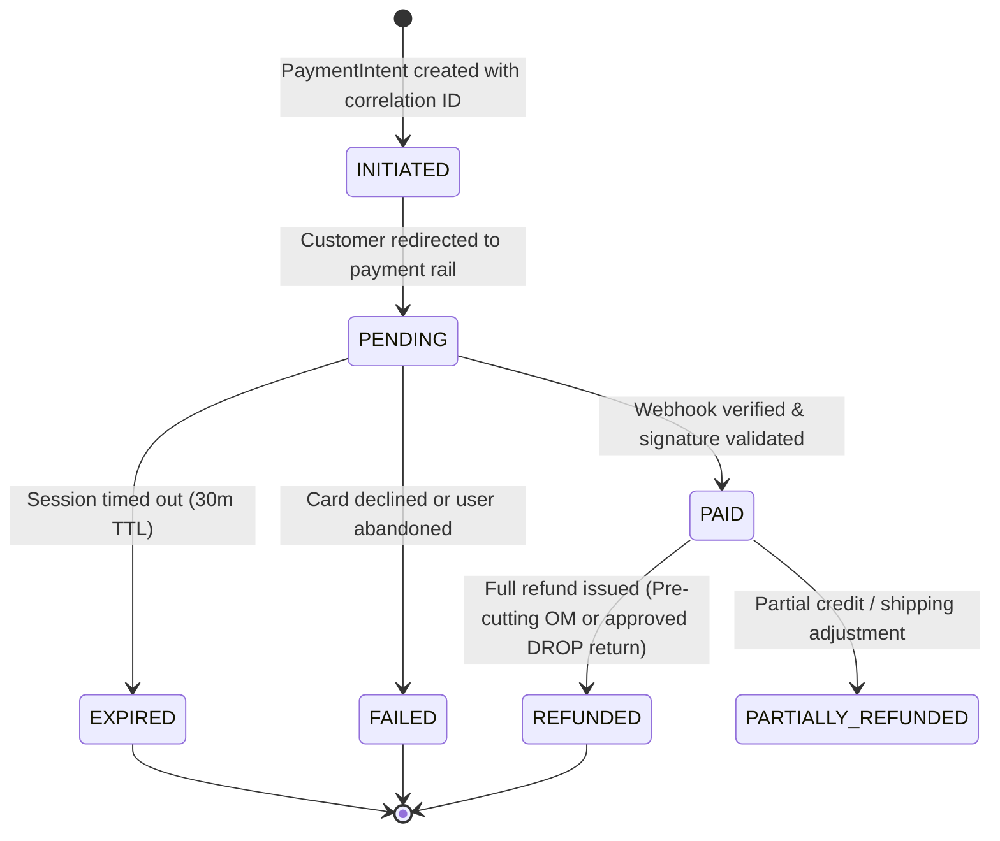
```mermaid
stateDiagram-v2
    [*] --> INITIATED: PaymentIntent created with correlation ID
    INITIATED --> PENDING: Customer redirected to payment rail
    PENDING --> EXPIRED: Session timed out (30m TTL)
    PENDING --> FAILED: Card declined or user abandoned
    PENDING --> PAID: Webhook verified & signature validated
    
    PAID --> REFUNDED: Full refund issued (Pre-cutting OM or approved DROP return)
    PAID --> PARTIALLY_REFUNDED: Partial credit / shipping adjustment
    
    EXPIRED --> [*]
    FAILED --> [*]
    REFUNDED --> [*]
```

</details>

### Reconciliation & Multi-Rail Rules
1. **Multi-Rail Routing:**
   * **International Rail (USD):** Dispatched to Stripe Checkout (Cards, Apple Pay).
   * **Nepal Domestic Rail (NPR):** Dispatched to domestic digital wallets (eSewa, Khalti, Fonepay).
2. **Display vs. Settlement Separation:** Storefront displays customer currency (USD / EUR / NPR); merchant settlement occurs in the rail's native currency.
3. **Webhook Idempotency:** Webhook handlers record the gateway's event ID in an audit log. Duplicate webhook callbacks return `200 OK` immediately without re-triggering order state transitions.

---

## 10. OM Production Operations & Cut Ticket Specs (JN-010)

Entering the `CUTTING` stage generates an immutable, printable **Cut Ticket** work order for the workshop tailor:

### Cut Ticket Specification
* **Job Identification:** `jobId`, `orderNumber`, `orderLineId`, `artisanAssigned`.
* **Pattern Measurements:** Custom Fit (Straight / Slim / Relaxed), Waist circumference (inches), Front Rise, Back Rise, Knee, Inseam length, Leg opening.
* **Denim Specifications:** Fabric roll lot (e.g., Kurabo 14oz Pink Selvedge), shrinkage allowance applied (+3% for raw rinse).
* **Hardware & Thread:** Thread color (Tobacco / Indigo / Gold), button metal (Antique Brass / Solid Silver), pocket bag cloth.
* **Timestamps & SLA:** `orderPaidAt`, `targetCompletionDate` (calculated from `ProductionPolicy`).

### Delay Escalation & Rework Protocols
1. **Delay Management:** If a job encounters a bottleneck (e.g., custom button stockout), the tailor records a formal `delayReason` and estimated revised completion date, automatically notifying support.
2. **QC Rework Protocol:** If a garment fails the Stage 6 QC inspection (tolerance exceeded > ±0.25"), it is transitioned back to `SEWING` with a tagged defect note rather than discarded.

---

## 11. Shipment Lifecycle & Logistics Operations (JN-011)

All physical shipments dispatch from the Jeanius workshop fulfillment hub in Kathmandu, Nepal, utilizing DHL Express, Aramex, or registered Nepal Post for international deliveries:



<details>
<summary>View Diagram Source (Mermaid)</summary>

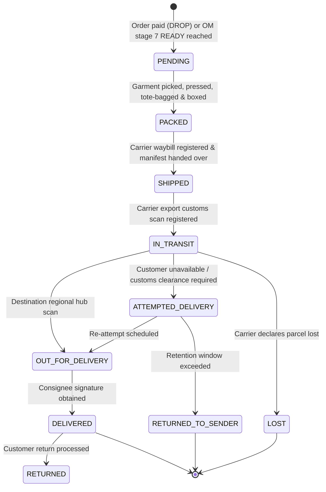
```mermaid
stateDiagram-v2
    [*] --> PENDING: Order paid (DROP) or OM stage 7 READY reached
    PENDING --> PACKED: Garment picked, pressed, tote-bagged & boxed
    PACKED --> SHIPPED: Carrier waybill registered & manifest handed over
    SHIPPED --> IN_TRANSIT: Carrier export customs scan registered
    IN_TRANSIT --> OUT_FOR_DELIVERY: Destination regional hub scan
    OUT_FOR_DELIVERY --> DELIVERED: Consignee signature obtained
    
    IN_TRANSIT --> ATTEMPTED_DELIVERY: Customer unavailable / customs clearance required
    ATTEMPTED_DELIVERY --> OUT_FOR_DELIVERY: Re-attempt scheduled
    ATTEMPTED_DELIVERY --> RETURNED_TO_SENDER: Retention window exceeded
    IN_TRANSIT --> LOST: Carrier declares parcel lost
    
    DELIVERED --> RETURNED: Customer return processed
    RETURNED_TO_SENDER --> [*]
    LOST --> [*]
    DELIVERED --> [*]
```

</details>

### Logistics Rules & Operational Invariants
1. **Immutable Waybill Binding:** Once a shipment transitions to `SHIPPED`, its `carrier` and `trackingNumber` are immutable. Any reshipment creates a new `Shipment` record linked to the original Order.
2. **Inspection Window Activation:** The carrier webhook registering the `DELIVERED` status updates `deliveredAt`, immediately starting the immutable 5-day DROP `InspectionWindow`.
3. **Customs & Commercial Invoice:** Every international parcel originating from Kathmandu includes an automated commercial invoice declaring harmonized tariff code `6203.42` (men's cotton denim trousers) or `6204.62` (women's cotton denim trousers).
4. **Split Shipments:** Orders containing both ready-to-ship DROP items and OM items are defaulted to single-dispatch upon OM completion, unless split-shipping is explicitly requested and funded at checkout.

---

## 12. Return & Refund Policy Lifecycle (JN-012)

Customer return requests follow a strict state machine governed by the commerce model and physical inspection criteria:



<details>
<summary>View Diagram Source (Mermaid)</summary>

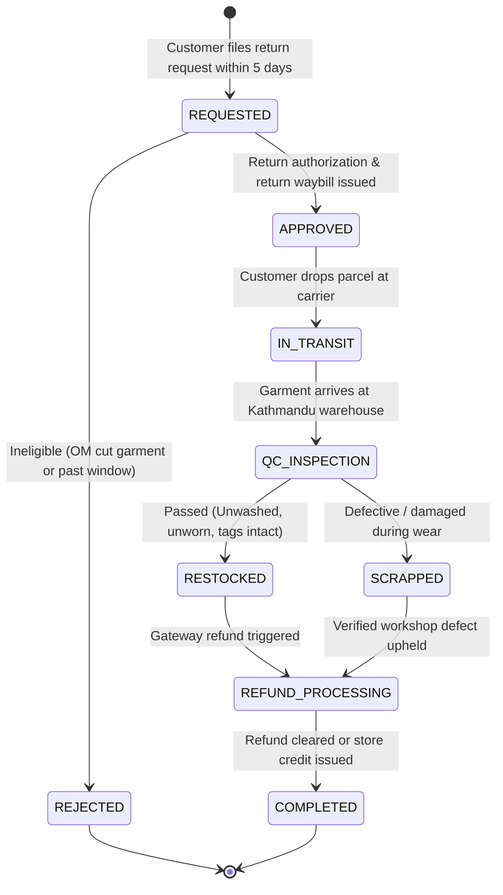
```mermaid
stateDiagram-v2
    [*] --> REQUESTED: Customer files return request within 5 days
    REQUESTED --> REJECTED: Ineligible (OM cut garment or past window)
    REQUESTED --> APPROVED: Return authorization & return waybill issued
    APPROVED --> IN_TRANSIT: Customer drops parcel at carrier
    IN_TRANSIT --> QC_INSPECTION: Garment arrives at Kathmandu warehouse
    
    QC_INSPECTION --> RESTOCKED: Passed (Unwashed, unworn, tags intact)
    QC_INSPECTION --> SCRAPPED: Defective / damaged during wear
    
    RESTOCKED --> REFUND_PROCESSING: Gateway refund triggered
    SCRAPPED --> REFUND_PROCESSING: Verified workshop defect upheld
    
    REFUND_PROCESSING --> COMPLETED: Refund cleared or store credit issued
    REJECTED --> [*]
    COMPLETED --> [*]
```

</details>

### Return Policy Invariants
1. **OM Non-Returnable Invariant:** Made-to-order (`OM`) garments are strictly **final sale** once cutting has commenced. The only exception is a verified manufacturing defect where measured garment dimensions deviate beyond ±0.25" from the approved Cut Ticket.
2. **DROP 5-Day Eligibility:** DROP items can only be returned if the return is requested within 5 calendar days of the carrier's verified delivery timestamp (`deliveredAt`).
3. **Condition Criteria:** Garments must be unworn, unwashed, and returned in original condition with all pocket flashers, selvedge ID stickers, and leather patch tags intact.
4. **Refund Processing:** Approved returns result in a direct refund reversal via the original payment rail (Stripe card reversal or Nepal digital wallet refund) or store credit, triggered only after physical warehouse QC approval.

---

## 13. Membership & Access Control Model (JN-013)

Access to collections, editorial content, and workshop operations is governed by an explicit four-tier access hierarchy:

| Access Level | Permitted Actors | Catalog Visibility | Purchasing Privileges | Administrative Rights |
| :--- | :--- | :--- | :--- | :--- |
| **PUBLIC** | `GUEST` (Unauthenticated) | Standard OM & DROP products, public lookbooks, sizing guide | Full checkout on public items | None |
| **AUTHENTICATED**| `CUSTOMER` | Public catalog + personal order history, saved addresses, live tracking | Full checkout, review submission | None |
| **MEMBER** | `MEMBER` | Public catalog + restricted `Together` drops, early access previews | Member pricing, exclusive community fabric allocations | Community features |
| **INTERNAL_STAFF** | `TAILOR`, `FULFILLMENT`, `SUPPORT`, `ADMIN` | Full catalog, draft previews, internal costs | Staff purchases | Operations board, Cut Tickets, Order management |

### Security & Anti-Leakage Invariants
1. **Zero Metadata Leakage:** Products with `accessLevel: 'MEMBER'` do not expose pricing, high-resolution media, or variant IDs in public React Server Component (RSC) HTML payloads, public REST feeds, or XML sitemaps.
2. **Server-Side Enforcement:** Attempting to view or purchase a member-restricted product without a verified session containing `role: 'MEMBER'` throws a 404 or redirects to authentication. Client-side hiding alone is unacceptable.

---

## 14. Customer Support & Custom-Order Boundaries (JN-014)

Jeanius strictly delineates communication channels between conversational pre-sales and authoritative transactional support:



<details>
<summary>View Diagram Source (ASCII Architecture)</summary>

```text
┌─────────────────────────────────┐       ┌─────────────────────────────────┐
│     INSTAGRAM DM (@jeanius)     │       │     EMAIL (support@jeanius)     │
│ • Sizing advice & fit guidance  │       │ • Order cancellation requests   │
│ • Raw denim fading inspiration  │       │ • Address corrections (Pre-cut) │
│ • Fabric origin storytelling    │       │ • Formal return authorizations  │
│ ──► Directs to on-platform link │       │ • Carrier disputes & claims     │
└─────────────────────────────────┘       └─────────────────────────────────┘
                 │                                         │
                 └────────────────────┬────────────────────┘
                                      ▼
                    ┌───────────────────────────────────┐
                    │      STOREFRONT CUSTOM ORDER      │
                    │ • Structured bespoke inquiry form │
                    │ • Measurement & photo uploads     │
                    │ • Tailor quote & SLA generation   │
                    │ • Conversion to payable Order     │
                    └───────────────────────────────────┘
```

</details>

### Channel Protocols & Service Level Agreements (SLAs)
1. **Instagram DM Protocol:** Social channels are strictly informational and non-transactional. Support agents never accept payment details, modify addresses, or cancel orders via DM. Customers are routed to the authenticated platform.
2. **Order Modification Window:** Customers may request shipping address or measurement updates via email exclusively during the `QUEUED` stage. Once a job enters `CUTTING`, measurement modifications are strictly locked.
3. **Custom-Order Inquiry Flow:** Bespoke requests (non-standard silhouettes, deadstock fabric bolts, bespoke embroidery) are submitted via the dedicated storefront form. Staff review inquiries in `apps/admin`, enter fixed price quotes and lead-time estimates, and generate a secure checkout link for customer authorization.

---

## 15. Transactional Outbox & Reliable Asynchronous Events

To eliminate dual-write hazards and guarantee at-least-once delivery of notifications, workshop cutting alerts, and logistics waybills, all domain events are written atomically within the business database transaction:

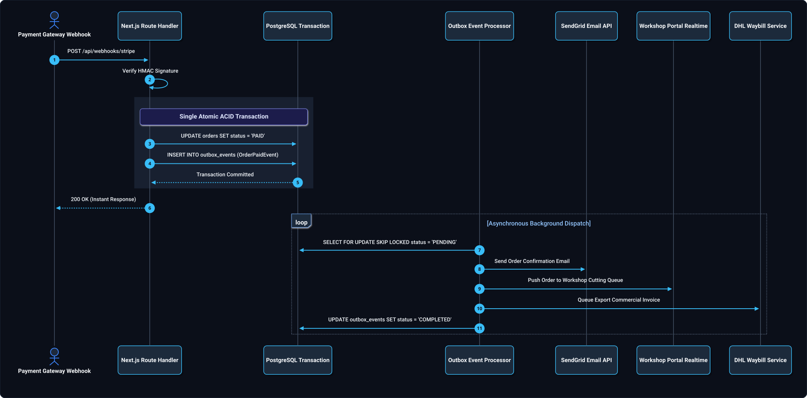

<details>
<summary>View Diagram Source (Mermaid)</summary>

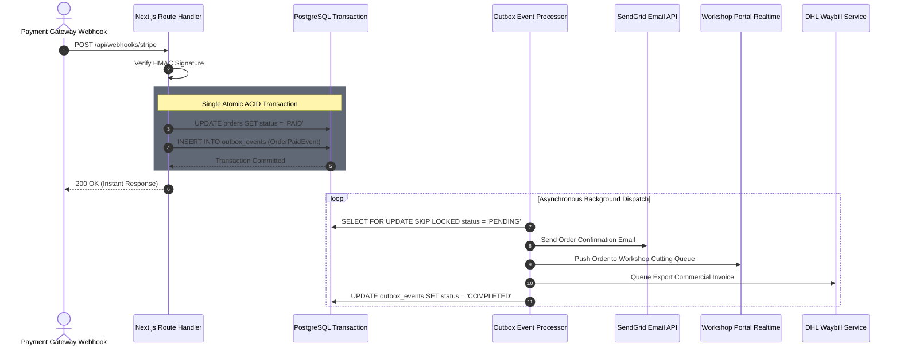
```mermaid
sequenceDiagram
    autonumber
    actor Webhook as Payment Gateway Webhook
    participant RouteHandler as Next.js Route Handler
    participant DB as PostgreSQL Transaction
    participant Worker as Outbox Event Processor
    participant Email as SendGrid Email API
    participant Workshop as Workshop Portal Realtime
    participant Logistics as DHL Waybill Service

    Webhook->>RouteHandler: POST /api/webhooks/stripe
    RouteHandler->>RouteHandler: Verify HMAC Signature

    rect rgba(30, 41, 59, 0.7)
        Note over RouteHandler,DB: Single Atomic ACID Transaction
        RouteHandler->>DB: UPDATE orders SET status = 'PAID'
        RouteHandler->>DB: INSERT INTO outbox_events (OrderPaidEvent)
        DB-->>RouteHandler: Transaction Committed
    end

    RouteHandler-->>Webhook: 200 OK (Instant Response)

    loop Asynchronous Background Dispatch
        Worker->>DB: SELECT FOR UPDATE SKIP LOCKED status = 'PENDING'
        Worker->>Email: Send Order Confirmation Email
        Worker->>Workshop: Push Order to Workshop Cutting Queue
        Worker->>Logistics: Queue Export Commercial Invoice
        Worker->>DB: UPDATE outbox_events SET status = 'COMPLETED'
    end
```

</details>

### Outbox Guarantees
1. **Atomicity:** An order cannot be marked `PAID` without staging its `OrderPaidDomainEvent` in `outbox_events`.
2. **Sub-100ms Response:** Webhooks and checkout Server Actions return immediately without waiting for third-party HTTP roundtrips.
3. **Idempotent Dispatch:** Consumers handle duplicate deliveries idempotently using the unique event UUID.

