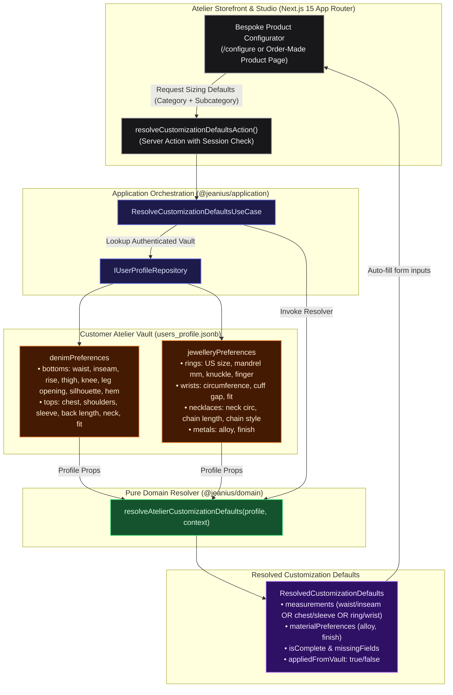

# Atelier Measurements Vault & Customization Auto-Fill — Walkthrough

This walkthrough details the implementation of the **Enriched Atelier Measurements Vault** and the **Customization Auto-Fill Resolver** for **Jeanius & Jewl**.

---

## 1. What Was Implemented

### A. Multi-Zone Atelier Vault Schema
The customer profile now captures anatomical and craft-specific dimensions across all garment and jewellery categories:

1. **Denim & Tailoring (`denimPreferences`):**
   - **Lower Body (`bottoms`):** `waistInches`, `inseamInches`, `riseInches` (front rise), `thighInches`, `kneeInches`, `legOpeningInches`, `silhouette` (`STRAIGHT`, `SLIM_TAPERED`, `WIDE_LEG`, `RELAXED_TAPERED`, `BOOTCUT`), `hemAllowanceInches`.
   - **Upper Body (`tops`):** `chestInches`, `shoulderWidthInches`, `sleeveLengthInches`, `backLengthInches`, `neckInches`, `fitPreference` (`SLIM`, `REGULAR`, `BOXY`, `OVERSIZED`).
2. **Jewellery & Metalsmithing (`jewelleryPreferences`):**
   - **Fingers (`rings`):** `ringSizeUs`, `ringMandrelMm`, `knuckleClearanceMm`, `preferredFinger` (`INDEX`, `MIDDLE`, `RING`, `PINKY`, `THUMB`).
   - **Wrists (`wrists`):** `wristCircumferenceInches`, `cuffGapMm`, `braceletFit` (`SNUG`, `COMFORT`, `LOOSE`).
   - **Neck / Chains (`necklaces`):** `neckCircumferenceInches`, `preferredChainLengthInches`, `chainStyle` (`CABLE`, `CURB`, `ROPE`, `BOX`, `FIGARO`).
   - **Metallurgy (`metals`):** `preferredAlloy` (`STERLING_SILVER_925`, `SOLID_BRASS`, `GOLD_18K`, `WHITE_GOLD_14K`), `preferredFinish` (`HIGH_POLISH`, `SATIN_MATTE`, `OXIDIZED_PATINA`, `HAMMERED_RAW`).
3. **100% Backward Compatibility:**
   - Retained top-level convenience properties (`waistInches`, `ringSizeUs`, `preferredAlloy`) and automatic normalization getters (`bottomsPreferences`, `ringPreferences`, etc.). Existing DB records and past orders continue working seamlessly.

---

### B. Category-Aware Customization Auto-Fill Resolver
Created a pure domain resolver (`resolveAtelierCustomizationDefaults`) in `packages/domain/src/user/customization-resolver.ts`:
- **Context-Driven:** Takes an `AutoFillContext` (`category: 'BOTTOMS' | 'TOPS' | 'JEWELLERY' | 'ACCESSORIES'`, optional `subcategory`).
- **Precision Mapping:**
  - `BOTTOMS` (e.g. Jeans): Resolves waist, inseam, silhouette, rise, thigh, hem allowance.
  - `TOPS` (e.g. Type II Denim Jacket): Resolves chest, shoulder width, sleeve length, back length, fit preference.
  - `JEWELLERY` with `RING`: Resolves ring size US, mandrel diameter in mm, preferred finger, alloy, and finish. Wrist dimensions are omitted from ring configurations.
  - `JEWELLERY` with `BRACELET` / `CUFF`: Resolves wrist circumference, cuff opening gap, bracelet fit, alloy, and finish.
  - `JEWELLERY` with `NECKLACE`: Resolves neck circumference, chain length, chain style, alloy, and finish.
  - `ACCESSORIES` with `BELT`: Automatically maps waist circumference from bottoms and hardware metal.
- **Completeness & Missing Fields:** Reports `isComplete` and `missingFields` so the studio UI knows exactly which inputs still require customer entry.
- **Graceful Fallback:** Supports unauthenticated / guest patrons by returning empty defaults and the required fields for the selected product.

---

### C. Architecture Diagram


<details>
<summary>View Raw Diagram Source (.mmd)</summary>


</details>

---

## 2. Verification Results

All tests across domain, application, database, and Next.js applications pass with **0 errors**:

```bash
$ ./scripts/verify-monorepo.sh
1. Checking pnpm workspaces...
2. Running Prettier format check...
   All matched files use Prettier code style!
3. Running ESLint across monorepo...
   $ eslint . (0 errors, 0 warnings)
4. Running typecheck across all workspaces...
   11/11 workspaces passed
5. Running build across all workspaces...
   ✔ @jeanius/domain test (32 tests pass)
   ✔ @jeanius/application test (9 tests pass)
   ✔ @jeanius/database test (5 tests pass)
   Total: 46 unit/integration tests passing (0 failures)
   ✔ @jeanius/admin production build (Next.js 15.5)
   ✔ @jeanius/storefront production build (Next.js 15.5)
6. Monorepo verified successfully with 0 errors!
```
