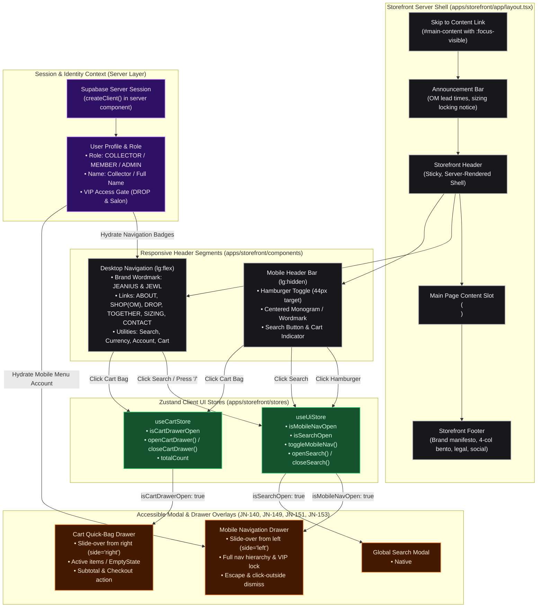

# State 07: Store Frontend Shell — Walkthrough & Verification

This document provides a walkthrough of the completed **State 07 — Store Frontend Shell (JN-145 through JN-156)** for **Jeanius & Jewl**, delivering the luxury editorial storefront shell across desktop, tablet, and mobile viewports.

---

## 1. Architectural Overview & System Flow

The storefront shell orchestrates a seamless interplay between server-rendered layouts, server-side auth identity hydration, and interactive client overlay islands (search, quick bag, mobile navigation drawer):

View Raw Diagram Source (.mmd)

---

## 2. Completed Deliverables (JN-145 → JN-156)

### A. Metadata & SEO Defaults (JN-145)
- **[metadata.ts](file:///home/sarakb/projects/Jeanius/apps/storefront/lib/metadata.ts):** Centralized Next.js 15 metadata builder defining title templates (`%s | Jeanius & Jewl`), description, canonical URL base (`https://jeanius.studio`), OpenGraph cards, Twitter cards, keywords, and robots indexing.
- Helper `createStorefrontMetadata(overrides)` allows child routes and PDPs to customize metadata while inheriting base defaults.

### B. Root Layout Architecture (JN-146)
- **[layout.tsx](file:///home/sarakb/projects/Jeanius/apps/storefront/app/layout.tsx):** Root layout coordinating:
  - Skip-to-content anchor (`#main-content`) with `:focus-visible` outline.
  - `<AnnouncementBar />` operational notice.
  - `<StorefrontHeader />` sticky header shell.
  - Semantic `<main id="main-content" role="main">` landmark.
  - `<StorefrontFooter />` 4-column Bento layout.
  - Global client overlays (`<SearchModal />`, `<CartDrawer />`) wrapped inside `<ToastProvider>`.

### C. Responsive Editorial Header (JN-147, JN-148, JN-155)
- **[desktop-header.tsx](file:///home/sarakb/projects/Jeanius/apps/storefront/components/desktop-header.tsx):** Desktop view (`hidden lg:flex`) with `JEANIUS & JEWL` wordmark, canonical navigation links (`ABOUT/GUIDE`, `SHOP (OM)`, `DROP`, `TOGETHER`, `SIZING`, `CONTACT`), `🔒 VIP` lock indicator for guests, currency badge (`USD`), and search/account/cart utilities.
- **[mobile-header.tsx](file:///home/sarakb/projects/Jeanius/apps/storefront/components/mobile-header.tsx):** Mobile view (`flex lg:hidden`) with 44x44px touch targets: accessible hamburger button, centered brand wordmark, search trigger, and cart indicator.
- **[storefront-header.tsx](file:///home/sarakb/projects/Jeanius/apps/storefront/components/storefront-header.tsx):** Server Component hydrating auth session and rendering responsive header segments with sticky positioning, backdrop blur, and embedded `<MobileDrawer />`.

### D. Accessible Drawer & Overlays (JN-149, JN-151, JN-153)
- **[mobile-drawer.tsx](file:///home/sarakb/projects/Jeanius/apps/storefront/components/mobile-drawer.tsx):** Left slide-over navigation drawer using `Drawer` primitive (`position="left"`), full hierarchical links, VIP drop badge, account summary/actions, and currency telemetry.
- **[search-trigger.tsx](file:///home/sarakb/projects/Jeanius/apps/storefront/components/search-trigger.tsx) & [search-modal.tsx](file:///home/sarakb/projects/Jeanius/apps/storefront/components/search-modal.tsx):** Search trigger with `<kbd>/</kbd>` shortcut and native `<dialog>` modal with global keyboard listeners (`/` and `Cmd+K` / `Ctrl+K`), autofocus, and instant suggested search pills.
- **[cart-indicator.tsx](file:///home/sarakb/projects/Jeanius/apps/storefront/components/cart-indicator.tsx) & [cart-drawer.tsx](file:///home/sarakb/projects/Jeanius/apps/storefront/components/cart-drawer.tsx):** Shopping bag icon with live item count badge and right slide-over quick bag drawer displaying active items or `<EmptyState>` with "Explore Atelier" CTA.

### E. Operational Notice & Account State (JN-152, JN-154)
- **[announcement-bar.tsx](file:///home/sarakb/projects/Jeanius/apps/storefront/components/announcement-bar.tsx):** Restrained operational notice communicating Order-Made (OM) lead times (14–21 business days), bespoke sizing locked upon cutting, and worldwide dispatch notes, with `sessionStorage` dismiss memory.
- **[account-nav-state.tsx](file:///home/sarakb/projects/Jeanius/apps/storefront/components/account-nav-state.tsx):** Server-authenticated collector identity displaying role badge (`COLLECTOR`, `MEMBER ★`, `ADMIN`), name, `/account` link, and quick sign-out action; guest fallback with "Sign In" and "Register".

### F. Editorial Atelier Footer (JN-150)
- **[storefront-footer.tsx](file:///home/sarakb/projects/Jeanius/apps/storefront/components/storefront-footer.tsx):** Studio manifesto header, 4-column Bento grid (Atelier Works, Craft & Sizing, Client Care & Policies, Studio Dispatch newsletter), copyright with dynamic year, social links (`X`, `Instagram`), and location telemetry (`Kathmandu & Seoul`).

### G. Shell Accessibility & Automated Tests (JN-156)
- **[shell.test.tsx](file:///home/sarakb/projects/Jeanius/apps/storefront/lib/shell.test.tsx):** Automated test suite verifying SEO metadata defaults, desktop navigation, mobile header, drawer overlays, search modal, cart bag, account state, and accessibility landmarks.

---

## 3. Visual Polish, Typography & Two-Tier Header Architecture

In response to visual testing feedback on layout density and typography fallback:

### A. Curated Typography Stack
- **Google Fonts Injection:** Preconnected and loaded `Playfair Display` (editorial serif headings), `Plus Jakarta Sans` (refined geometric sans-serif body), and `JetBrains Mono` (technical workshop telemetry) in [layout.tsx](file:///home/sarakb/projects/Jeanius/apps/storefront/app/layout.tsx) and [globals.css](file:///home/sarakb/projects/Jeanius/apps/storefront/app/globals.css).
- Replaced default system serif fallbacks (Times New Roman) with authentic high-contrast luxury serif rendering and tight letter tracking (`tracking-tight`, `tracking-widest`).

### B. Two-Tier Header with Dedicated Search Discovery Sub-Bar
- **Tier 1 (Main Navigation):**
  - Brand wordmark with `Playfair Display` and `ATELIER · KTM & SEOUL` micro-badge.
  - Spaced canonical navigation links (`About/Guide`, `Shop (OM)`, `Drop 🔒 VIP`, `Together`, `Sizing`, `Contact`).
  - Elevated guest utilities with clean `USD ($)` currency badge, understated `Sign In`, and tactile rounded-pill `Register` button.
- **Tier 2 (Discovery Sub-Bar — Placed Below):**
  - Moved search out of the crowded top navigation row into a dedicated, aesthetic secondary discovery bar.
  - Elongated pill-shaped search trigger with subtle inset shading, magnifying glass icon, and `<kbd>/</kbd>` keyboard indicator.
  - Curated quick-filter discovery pills (`14oz Kurabo Selvedge`, `Ring Mandrel Chart`, `OM Lead Times`, `925 Sterling Silver`, `Drop 01 Vault`).

### C. Rich Atelier Home Page & Editorial Routes
- **Home Page (`apps/storefront/app/page.tsx`):**
  - Editorial hero with oversized serif typography ("PRECISION RAW SELVEDGE & BESPOKE SILVERSMITHING").
  - Live workshop telemetry ribbon (`14-21 Workshop Days`, `Kurabo Mills 14oz`, `Solid 925 Sterling Silver`, `Lifetime Repair Backing`).
  - Featured catalog bento grid showcasing **Lot 001 — Straight Raw Selvedge** ($280.00) and **Lot 002 — Solid Silver 925 Signet Ring** ($195.00).
  - Atelier craft standards ("Point of No Return", "Heritage Metals & Dye", "Lifetime Workshop Backing").
- **Implemented Editorial Routes:**
  - `/about`: Kathmandu cutting tables, Seoul bench, OM order protocol, lifetime warranty.
  - `/sizing`: Denim flat measurement guide, 14oz Kurabo shrinkage matrix, and calibrated US ring mandrel table (US 5–13).
  - `/contact`: Concierge consultation intake form and Kathmandu/Seoul physical studio directories.
  - `/drop`: VIP Member vault gate with authentication check, member unlock banner, and archival drop previews.
  - `/together`: Patina journal, raw indigo fading timeline (Day 1, Month 6, Year 2), and lifetime repair intake CTA.

---

## 4. Verification & Monorepo Health

- **Storefront Unit Tests:** `pnpm --filter @jeanius/storefront test` passed with **70/70 assertions green**.
- **Monorepo Test Suite:** `pnpm run test` passed with **146/146 tests passing across all 12 workspaces**.
- **Full Verification Script:** `./scripts/verify-monorepo.sh` passed with **0 errors**:
  - `pnpm ls -r --depth -1` ✓
  - `pnpm run format:check` ✓ (100% Prettier compliant)
  - `pnpm run lint` ✓ (0 ESLint errors)
  - `turbo run typecheck` ✓ (10/10 workspaces passing `tsc --noEmit`)
  - `turbo run build` ✓ (10/10 workspaces compiled successfully, all 14 storefront routes generated statically)
